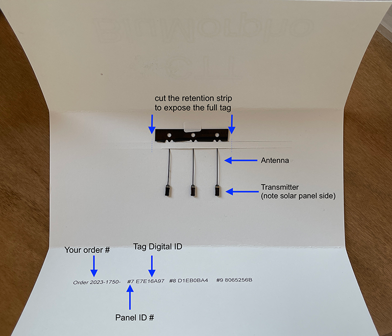
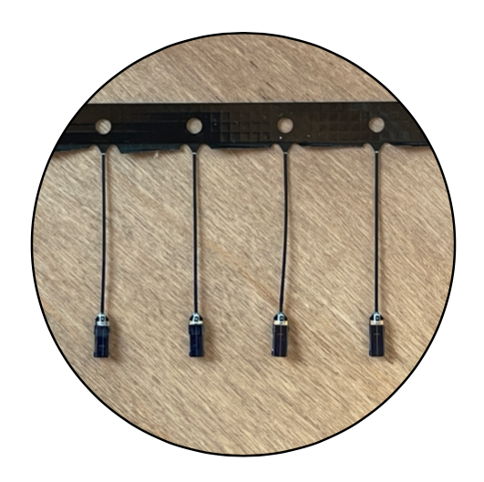
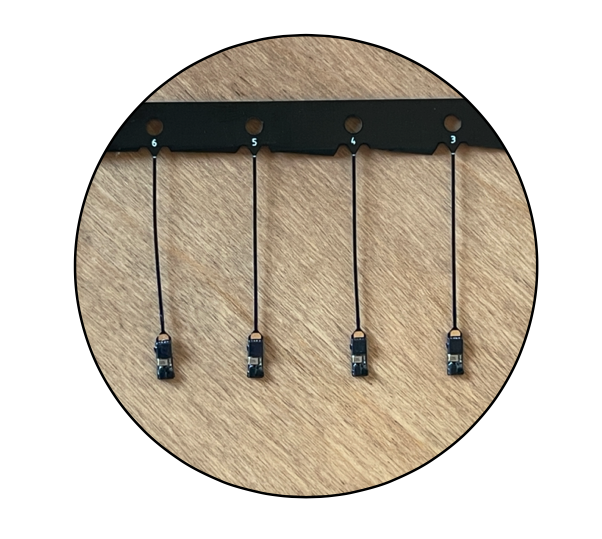
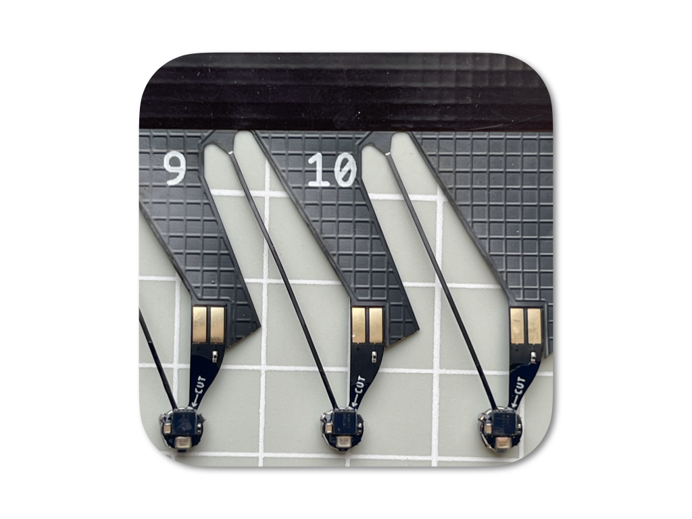
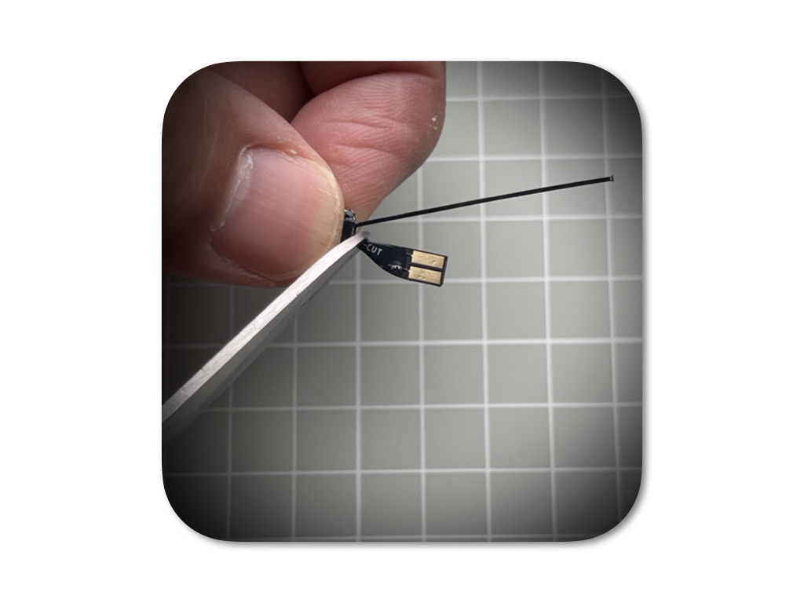
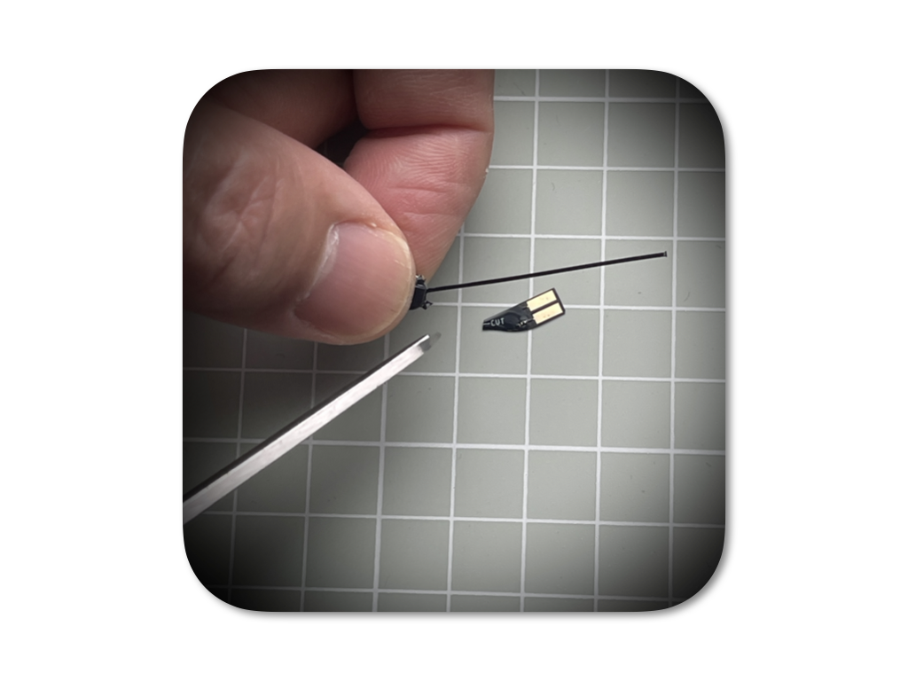

```{r setup, include=FALSE}
knitr::opts_chunk$set(echo = TRUE)
```

<style>
body {
  line-height: 1.55;
}

.main-container {
  max-width: 1040px;
}

h1 {
  margin-top: 2.4rem;
  padding: 0.8rem 1rem;
  border-left: 8px solid #214b63;
  border-bottom: 1px solid #d8e0e5;
  background: #f3f7f9;
}

h2 {
  margin-top: 2rem;
  padding-top: 0.6rem;
  border-top: 3px solid #90a9b8;
}

h3 {
  margin-top: 1.25rem;
  color: #214b63;
}

table {
  width: 100%;
  margin: 1rem 0 1.4rem;
}

th {
  background: #edf3f6;
}

td,
th {
  vertical-align: top;
}

.guide-note {
  margin: 1rem 0 1.4rem;
  padding: 0.8rem 1rem;
  border-left: 5px solid #517f95;
  background: #f6fafb;
}

.critical-note {
  margin: 1rem 0 1.4rem;
  padding: 0.9rem 1rem;
  border-left: 6px solid #b33a2b;
  background: #fff2ef;
  font-weight: 600;
}

.print-checklist p {
  margin: 0.35rem 0;
}

li input[type="checkbox"] {
  display: none;
}

li label {
  pointer-events: none;
  font-weight: normal;
}

li label::before {
  content: "☑";
  display: inline-block;
  margin-right: 0.45rem;
  font-size: 1.05rem;
  line-height: 1;
}

@media print {
  body {
    font-size: 11pt;
  }

  a[href]:after {
    content: "";
  }

  h1,
  h2 {
    page-break-after: avoid;
  }

  img {
    max-width: 100%;
  }
}
</style>

# Introduction

CTT offers digitally-coded radio tags in two frequency families:

1. **434MHz radio tags**: LifeTag, PowerTag, and HybridTag.
2. **BlūSeries 2.4GHz radio tags**: BlūMorpho, BlūBat, and BlūBird.

Use this guide to identify your tag type, understand what is included with your shipment, test or activate tags before deployment, and confirm that tags are detectable with the correct CTT receiver.

If you run into any complications, please contact CTT through the `Customer Service Desk` [here](https://celltracktech.com/pages/customer-service-desk-csd).

## Tag Family Quick Reference

| Tag | Family | Power Type | Activation / Test Method | Detection Mentioned in Current Guide |
| :--- | :--- | :--- | :--- | :--- |
| LifeTag | 434MHz | Solar-only | Expose solar panel to direct light | CTT Sidekick or SensorStation |
| PowerTag | 434MHz | Battery-only | CTT Activator | CTT Sidekick or SensorStation |
| HybridTag | 434MHz | Solar-assisted rechargeable | Remove magnet; use sunlight if battery is flat | CTT Sidekick or SensorStation |
| BlūMorpho | BlūSeries 2.4GHz | Solar-only | Cut from panel at indicated cut line | Compatible receiver |
| BlūBat | BlūSeries 2.4GHz | Battery-only | Bridge test pads; sever test tab for permanent activation | Compatible receiver |
| BlūBird | BlūSeries 2.4GHz | Solar-assisted rechargeable | Remove magnet and verify with Sidekick | Sidekick |

## Before You Begin

<div class="guide-note">

For preparing to deploy any of these tag types, you will need a way to detect the tag. The current guide recommends either a `CTT Sidekick`, or an operational `SensorStation` and a way to connect to it, either via ethernet or WiFi adapter.

</div>

# 434MHz Radio Tags

CTT 434MHz radio tags include solar-only, battery-only, and hybrid solar/battery options.

## LifeTag Quick Start Guide

### Best For

LifeTag is a solar-only tag. It is appropriate for diurnally-active species that need the lightest weight available.

LifeTags can be as light as 0.35g. With a flexible tab for harnessing, light nitinol antenna, and enough epoxy coating to protect the tag from the elements, the tag will typically come in between 0.45 and 0.6g depending on the amount of epoxy.

Because of its battery-less design, the LifeTag can last for many seasons and years with proper attachment. LifeTag is programmed with a standard 5-second beep rate.

### What You'll Find in the Package

Each LifeTag ships with an 8-digit digital ID sticker.

### What You'll Need

- The unique digital IDs for each of your tags.
- A location where the LifeTag solar panel can receive direct light.
- A CTT Sidekick or operational SensorStation for confirming tag detection.
- If using a SensorStation, a computer connected to the SensorStation web interface.

### Before Deployment

1. Unpack your LifeTags.
2. Record the unique digital IDs for each tag.
3. Place each LifeTag with the solar panel facing up in a location where it can get direct light.
4. Keep the tags within detection range of your SensorStation or CTT Sidekick.

If you are not using antennas on your SensorStation, make sure tags are within a meter of the station.

### Activate or Test the Tag

LifeTags do not have a battery to activate. The tag should transmit when the solar panel receives enough light.

### Confirm Detection

If using the Sidekick, power up and connect your Sidekick to a smart device following the directions in the Sidekick User Guide [here](https://cellular-tracking-technologies.github.io/ctt_documentation/CTT-Sidekick-User-Guide.html).

If using a SensorStation:

1. Connect your computer to your SensorStation so you can view the web interface.
2. Consult the online install guide [here](https://cellular-tracking-technologies.github.io/ctt_documentation/v2-SensorStation-User-Guide.html#connecting-to-your-sensorstation-web-interface) if needed.
3. Ensure your SensorStation has at least one radio tuned to detect `Tags`.
4. Confirm the digital ID appears in either the Sidekick interface or on radio channels 1 through 5 in the SensorStation interface.

### Charging / Battery Notes

LifeTag is solar-only and does not have a battery.

### Troubleshooting

If you do not see the expected digital ID:

1. Confirm the solar panel is facing up and receiving direct light.
2. Confirm the tag is within detection range of the Sidekick or SensorStation.
3. If using a SensorStation, confirm at least one radio is tuned to detect `Tags`.

### Final Deployment Checklist

Make sure each item below is checked before deployment.

- ☐ Tag IDs recorded.
- ☐ Solar panel facing up.
- ☐ Tag exposed to direct light.
- ☐ SensorStation radio tuned to detect `Tags`, if using SensorStation.
- ☐ Tag detected by Sidekick or SensorStation.

## PowerTag Quick Start Guide

### Best For

PowerTag is a battery-only radio tag with a user-defined beep rate. It allows users to balance tag longevity and desired tag weight. It is appropriate for the smallest species, species that are only active at night, or species that spend most of their lives under dense cover.

### What You'll Find in the Package

Each PowerTag ships with an 8-digit digital ID sticker.

### What You'll Need

- The unique digital IDs for each of your tags.
- A CTT Activator to activate and deactivate the tag.
- A CTT Sidekick or SensorStation to confirm tag detection.

### Before Deployment

1. Unpack your PowerTags.
2. Record the unique digital IDs for each tag.
3. Confirm the expected beep rate from your order.

### Activate or Test the Tag

1. Follow the directions printed on the CTT Activator to activate your PowerTag.
2. Confirm activation on the Activator by seeing the red beep indicator light flashing at the expected beep rate.

If your tag fails to activate at first, try activating it in different orientations. The transmitter board can be on either side of the tag depending on the build, and the battery or a thick epoxy coating may preclude activation from a single orientation. Flipping the tag and trying again will usually resolve this.

All tags are activated and deactivated at CTT prior to shipping, so there is a correct orientation.

### Confirm Detection

It is best practice to confirm tag detection on either a CTT Sidekick or a CTT SensorStation. Follow the detection steps listed in the LifeTag section above.

### Charging / Battery Notes

PowerTag operates solely on battery.

If you have issues with your Activator, the most common problem is that the internal Activator battery is too low and needs to be recharged. Fully charge the Activator by plugging it in, or use the Activator while it is plugged into AC power.

### Troubleshooting

If the tag does not activate:

1. Try the Activator in different tag orientations.
2. Confirm the Activator battery is charged.
3. Try using the Activator while it is plugged into AC power.
4. Confirm tag detection with a Sidekick or SensorStation after activation.

### Final Deployment Checklist

Make sure each item below is checked before deployment.

- ☐ Tag IDs recorded.
- ☐ Expected beep rate confirmed from order.
- ☐ Tag activated with CTT Activator.
- ☐ Red beep indicator confirmed on Activator.
- ☐ Tag detected by Sidekick or SensorStation.

## HybridTag Quick Start Guide

### Best For

HybridTag is a solar-assisted rechargeable tag that combines LifeTag solar technology with a rechargeable battery. It can beep 24 hours a day, last multiple seasons and years, and only requires several hours of sunlight over the course of three days to remain fully charged.

The current guide describes a HybridTag as approximately 0.65g with light epoxy coating, flexible attachment tab, and light antenna.

### What You'll Find in the Package

Each HybridTag ships with:

- An 8-digit digital ID sticker.
- A small magnet taped to the back of the tag.

The magnet keeps the tag from using the battery to transmit its digital signal.

### What You'll Need

- The unique digital IDs for each tag.
- A CTT Sidekick or SensorStation to confirm tag detection.
- Direct sunlight if the tag battery needs to recharge.

### Before Deployment

1. Unpack your HybridTags.
2. Record the unique digital IDs for each tag.
3. Locate the tape and magnet on the back of each tag.

### Activate or Test the Tag

1. Remove the tape and magnet from the back of your HybridTag.
2. Store the magnet for turning off the HybridTag in the future, such as when you are done testing.
3. If the battery is charged, the tag should begin beeping immediately.

### Confirm Detection

If using the Sidekick, power up and connect your Sidekick to a smart device following the directions in the Sidekick User Guide [here](https://cellular-tracking-technologies.github.io/ctt_documentation/CTT-Sidekick-User-Guide.html).

If using a SensorStation:

1. Connect your computer to your SensorStation so you can view the web interface.
2. Consult the online install guide [here](https://cellular-tracking-technologies.github.io/ctt_documentation/v2-SensorStation-User-Guide.html#connecting-to-your-sensorstation-web-interface) if needed.
3. Ensure your SensorStation has at least one radio tuned to detect `Tags`.
4. Confirm the digital ID appears in either the Sidekick interface or on radio channels 1 through 5 in the SensorStation interface.

### Charging / Battery Notes

If the tag fails to beep and is not in the sun, place it in direct sun and see if it starts to function. If this happens, the battery is flat and needs to recharge.

To recharge:

1. Place the magnet back on the tag.
2. Place the tag in the sun for several hours to fully recharge.
3. Repeat the test again.
4. Cover the solar panel to ensure that your tag is beeping using battery power.

### Troubleshooting

If the tag does not beep:

1. Confirm the magnet has been removed.
2. Place the tag in direct sun.
3. Recharge the tag with the magnet back on the tag.
4. Test again after charging.
5. Confirm detection with a Sidekick or SensorStation.

### Final Deployment Checklist

Make sure each item below is checked before deployment.

- ☐ Tag IDs recorded.
- ☐ Magnet removed for testing/deployment.
- ☐ Magnet saved for later deactivation/testing.
- ☐ Tag beeping on battery power.
- ☐ Tag detected by Sidekick or SensorStation.
- ☐ Tag recharged if battery was flat.

# BlūSeries 2.4GHz Radio Tags

CTT's BlūSeries 2.4GHz tags include solar-only, battery-only, and solar-assisted rechargeable options.

<!-- Confirm final preferred public wording for BlūSeries detection pathways, Blū+ variants, and Motus/portal visibility before publication. -->

## Standard and Expanded BlūSeries Tags

BlūSeries tags are available in two variants:

- **Standard** BlūSeries tags.
- **Expanded** BlūSeries tags with Blū+.

Testing remains the same for both variants. If you are using Blū+, you should also activate your tag's data plan on the BlūSeries Portal, then allow the tag to beep in an urban or suburban environment so you can confirm that detections are displayed on the BlūSeries Portal.

## BlūMorpho Quick Start Guide

### Best For

BlūMorpho is a solar-powered 2.4GHz tag for very small animals. The current guide describes the tag as weighing about the same as a grain of rice, approximately 0.06g, and measuring less than 4cm with antenna included.

The current guide describes BlūMorpho as appropriate for species ranging from Monarch butterflies and bumble bees to hummingbirds and many more. BlūMorpho comes pre-set with a 3-second beep interval. Because it is solar-only, the lifespan is as long as the tag remains attached to the animal.

### What You'll Find in the Package

BlūMorpho tags arrive in a tri-fold envelope, suspended behind a retention strip.

The envelope includes:

- Your order number.
- The reference number printed on the panel to which your tags are attached.
- The Tag ID, which is the ID you will see when detecting your tag with a receiver.

The tag ID is not printed on the tag itself. The panel ID numbers are your reference to the full tag digital ID number that will show up on your receiver.

{#id .class width=50%}

### What You'll Need

- The order, panel, and tag ID information printed on the envelope.
- A sharp cutting tool for cutting at the indicated cut line.
- A compatible receiver for confirming tag detection.

<!-- Confirm preferred receiver language for BlūMorpho: Sidekick, BlūSeries Receiver, SensorStation with BlūSeries Receiver, CTT Node, or other. -->

### Before Deployment

1. Open the tri-fold envelope carefully.
2. Note the order number, panel reference number, and Tag ID information.
3. Confirm that the tags are solar-panel up, which is the way they should be deployed on an animal.
4. Identify the cut line at the top of the antenna where it meets the panel strip.

{#id .class width=45%}

{#id .class width=50%}

### Activate or Test the Tag

BlūMorpho is solar-only. As such, only solar exposure is required to trigger the tag to start beeping.

To remove the tag from the panel strip, cut only at the small white cut line at the top of the antenna where it meets the panel strip. This is the only place where you should cut your tag to remove it from the panel strip and deploy it on an animal.

### Confirm Detection

Confirm that the tag ID appears on your compatible receiver.

<!-- Add specific BlūMorpho detection steps once receiver language is confirmed. -->

### Charging / Battery Notes

BlūMorpho is solar-only.

### Troubleshooting

If the tag ID does not appear on your receiver:

1. Confirm the panel ID/reference information was recorded correctly.
2. Confirm the tag was cut only at the indicated cut line.
3. Confirm the solar panel is facing up.
4. Confirm you are using a compatible receiver.

### Final Deployment Checklist

Make sure each item below is checked before deployment.

- ☐ Order, panel, and tag ID information recorded.
- ☐ Tag solar panel facing up.
- ☐ Tag cut only at the indicated cut line.
- ☐ Tag ID confirmed on compatible receiver.

## BlūBat Quick Start Guide

### Best For

BlūBat is a battery-only 2.4GHz digitally-coded transmitter for species that require transmission in the dark or at night. The current guide describes it as appropriate for bats, birds, rodents, and more.

The current guide describes the base model BlūBat as weighing 0.16g and measuring 3.5cm total length including antenna.

### What You'll Find in the Package

BlūBat tags arrive paneled or de-paneled in individual packaging, with the testing tab attached.

Screen-printed numbers correspond to the tag IDs printed on the packaging.

{#id .class width=50%}

### What You'll Need

- Tag ID information from the packaging.
- Sharp scissors for depaneling and final activation.
- Metal tweezers or another metal object to bridge the test pads.
- Super glue or epoxy to seal the cut point after final activation.
- A compatible receiver to confirm tag detection.

<!-- Confirm preferred receiver language for BlūBat: Sidekick, BlūSeries Receiver, SensorStation with BlūSeries Receiver, CTT Node, or other. -->

### Before Deployment

1. Record the tag IDs printed on the packaging.
2. Identify the white cut line at the tip of the antenna.
3. Identify the testing tab.

To depanel while keeping the testing tab intact for continued testing prior to deployment, use sharp scissors to cut on the white line at the tip of the antenna and around the testing tab.

If deploying directly from the panel, you can cut on the white line with the cut arrow that attaches the tag to the testing tab.

### Activate or Test the Tag

With the tag separated from the panel, you can still test the tag by bridging the two gold pads on the testing tab.

{#id .class width=50%}

Testing is easiest with metal tweezers, but any metal will do. When bridged, the tag will beep. When unbridged, it will stop.

The gold-pad bridging method is for instantaneous testing only. Do not leave the pads bridged for any length of time. Testing this way draws more power than an activated tag and will reduce the life of the transmitter if left bridged.

When you are ready to deploy, use sharp scissors to cut on the white line between the tag and the testing tab. This permanently activates the tag.

{#id .class width=50%}

<div class="critical-note">

**Important:** Because severing the test tab exposes copper, you must put a drop of super glue or epoxy over the cut point and let it set before deploying the tag. This seal step is required to help the tag last the expected lifespan once deployed.

</div>

### Confirm Detection

Confirm that the tag ID appears on your compatible receiver.

<!-- Add specific BlūBat detection steps once receiver language is confirmed. -->

### Charging / Battery Notes

BlūBat is battery-only. Severing the test tab permanently activates the tag.

BlūBat lifespan depends on build, battery size, beep interval, and whether the tag is Standard or Expanded with Blū+. Use the [BlūBat configuration tool](https://celltracktech.com/pages/blubat-configuration-tool) to compare available options.

### Troubleshooting

If the tag does not beep during testing:

1. Confirm the testing tab is intact.
2. Confirm you are briefly bridging the two gold pads on the testing tab with metal tweezers or another metal object.
3. Confirm the tag was not already permanently activated by severing the test tab.

### Final Deployment Checklist

Make sure each item below is checked before deployment.

- ☐ Tag IDs recorded from packaging.
- ☐ Tag depaneled at the correct cut line.
- ☐ Tag tested by briefly bridging the gold pads.
- ☐ Test tab severed only when ready for permanent activation.
- ☐ Cut point sealed with super glue or epoxy before deployment.
- ☐ Tag ID confirmed on compatible receiver.

## BlūBird Quick Start Guide

{#id .class width=50%}

### Best For

BlūBird is a solar-assisted BlūSeries tag designed for deployments where 24-hour operation is required, such as recording nocturnal migration of a diurnally active species like many migratory birds.

<!-- Confirm final public positioning, weight range, beep interval options, and standard BlūBird configurations before publication. -->

### What You'll Find in the Package

Each BlūBird tag will arrive with a magnet attached. The magnet keeps the tag in a low-power state during shipping and storage.

{#id .class width=50%}


### What You'll Need

- A Sidekick receiver to verify operation and monitor battery voltage before deployment.
- Outdoor direct sunlight for charging.
- A way to record each tag ID, baseline voltage, and post-charge voltage.

### Before Deployment

BlūBird tags are shipped in a low-power state and are not shipped with fully charged batteries. Before deployment, all tags should be checked with a Sidekick, charged in direct sunlight, and checked again to confirm that the batteries are charging properly.

Because of the small size and tight manufacturing tolerances of these devices, some units may fail after manufacturing even though they were pre-tested. Always confirm function and battery charging before deploying BlūBird tags on live animals.

### Activate or Test the Tag

Start by collecting baseline data with your Sidekick before charging the tags:

1. Remove the BlūBird tags from the packaging.
2. Discard any plastic that was holding the magnets in place.
3. Remove the magnets from the tags you are checking.
4. Use the Sidekick to confirm that the tags are transmitting and reporting battery voltage.
5. Record the tag IDs and baseline battery voltages.
6. Reattach the magnets after collecting the baseline data.

You do not need to check tags individually. You can place all BlūBird tags out at once, collect detections with the Sidekick, and review the Sidekick CSV file afterward to retrieve the baseline voltage for each tag. You can also work with a smaller group of tags and monitor each one in the Sidekick using the real-time graph of time versus voltage. Both methods are effective.

After baseline data are recorded:

1. Remove the magnets and place the tags outdoors in direct sunlight for a couple of days.
2. Reattach the magnets at night to prevent the tags from discharging overnight.
3. After a couple of days of charging, cover the solar panels and collect post-charge voltage samples with the Sidekick.
4. Review the Sidekick data to confirm post-charge voltage for each tag in the shipment.

### Confirm Detection

Confirm that each tag appears on the Sidekick display, is transmitting normally, and is reporting battery voltage.

### Charging / Battery Notes

As each tag appears on the Sidekick display, note the reported battery voltage. Record a baseline voltage before charging, then record a second voltage after the tags have been exposed to direct sunlight for a couple of days.

Recommended voltage before deployment:

* **3.0 V or higher:** ready for deployment.
* **Below approximately 2.9 V:** additional charging is recommended before deployment.

The ending voltage after a couple of days in direct sunlight should be close to or just above 3.0 V, regardless of the starting voltage. For example, if a tag starts at 2.0 V and only reaches 2.1 V after two days in direct sunlight, the battery may not be charging effectively. If the voltage decreases after sun exposure, this also indicates a charging issue.

Recommended charging procedure:

1. Place the tags outdoors in direct sunlight whenever possible.
2. Leave the tags in direct sunlight for a couple of days.
3. Reattach the magnets at night to prevent discharge.
4. Cover the solar panels before taking the post-charge voltage sample.

The magnets may remain attached during charging if desired, although this is not required for charging to occur. If you remove the magnets for charging, remember to reattach them at night.

Until deployment, keep the tags in a well-lit location where they can continue to charge. Units will typically not charge through windows. Do **NOT** charge under the windshield of a car; extremely high temperatures will damage transmitters.

### Troubleshooting

If a tag does not begin transmitting immediately:

1. Reattach the magnet to the tag.
2. Wait a few seconds.
3. Remove the magnet again to reset the tag.
4. Check the Sidekick display for activity.

If the tag still does not appear, charge the tag in direct sunlight and then check it again.

After charging:

1. Remove the magnet from the tag.
2. Verify that the tag appears on the Sidekick display.
3. Confirm that the tag is transmitting normally.
4. Confirm that battery voltage has increased.

If a tag does not charge close to 3.0 V after a couple of days in direct sunlight, if the voltage only increases slightly from a low starting voltage, or if the voltage decreases after charging, contact Cellular Tracking Technologies for replacements. Do not deploy tags with non-charging batteries on live animals.

If the tag still does not transmit after charging and resetting, contact Cellular Tracking Technologies for support.

### Final Deployment Checklist

Make sure each item below is checked before deployment.

- ☐ Magnet removed and tag detected by Sidekick.
- ☐ Tag transmitting normally.
- ☐ Baseline battery voltage recorded before charging.
- ☐ Tag charged in direct sunlight for a couple of days.
- ☐ Magnets reattached at night during charging.
- ☐ Solar panel covered and post-charge voltage recorded.
- ☐ Battery voltage close to or above 3.0 V after charging.
- ☐ Non-charging tags set aside and reported to CTT.
- ☐ Final operation verified before attachment to a live animal.

# Final Thoughts

This User Guide is a living document. Your experiences and input are greatly appreciated so please don't hesitate to reach out to us regarding what you'd like to see included here. You can submit your suggestions and any errors to our `Customer Service Desk` [here](https://celltracktech.com/pages/customer-service-desk-csd) and we will work to incorporate them in future revisions. All material © Cellular Tracking Technologies, 2026.
