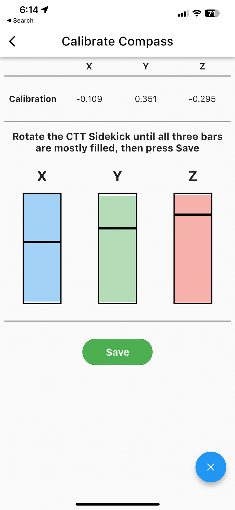
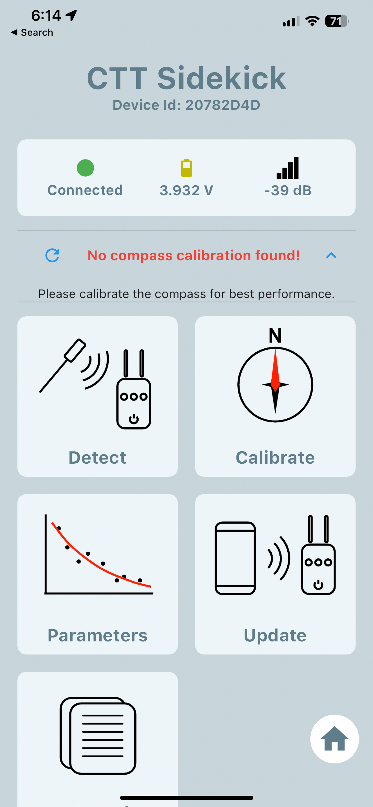
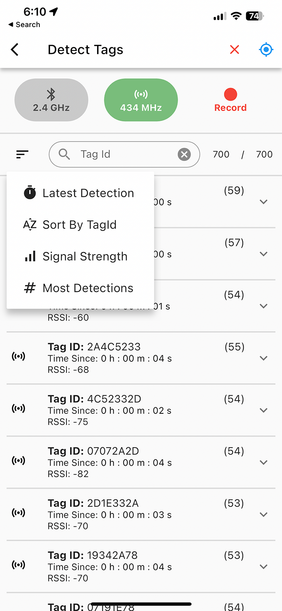
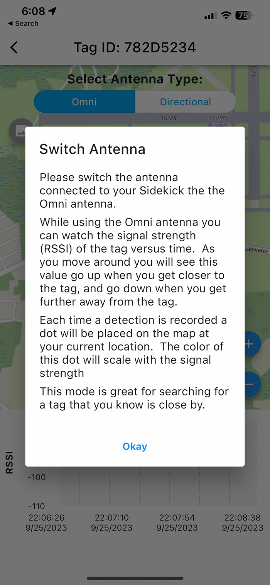
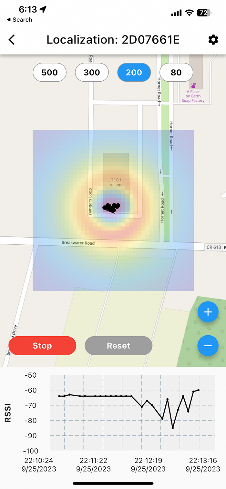
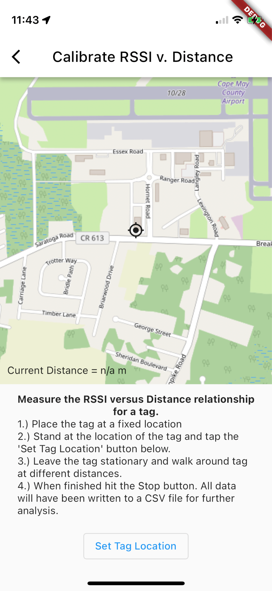
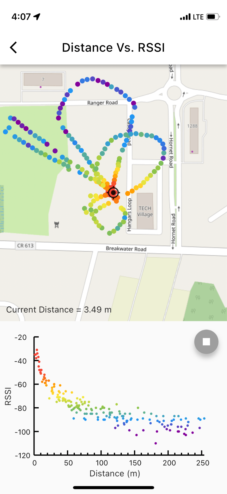

```{r setup, include=FALSE}
knitr::opts_chunk$set(echo = TRUE)
```

\newpage

<p class="pullquote">Every hero needs a trusty Sidekick</p>

**Disclaimer: This user guide is very much a DRAFT version and still being written. Please feel free to use it, but we do not recommend printing it out as it is under heavy development. Please send any feedback to support@celltracktech.com, and thank you in advance for your input!**

The CTT Sidekick is your new go-to tracking accessory for the full line of CTT radio tags, including both 434MHz and 2.4GHz frequencies. The Sidekick can detect and track all CTT LifeTags, PowerTags, HybridTags, and BlūMorpho tags and displays real time RSSI statistics, all through the companion phone app. 

# Package Contents

Your purchase of a CTT Sidekick comes with the following items: 

* CTT Sidekick 
* 2.4GHz omni antenna
* 434MHz omni antenna
* USB charging cable
* SMA port covers (2)

## Add-on options include:

* 5-element 434MHz yagi antenna (with handle and connecting cable)
* 2.4GHz yagi antenna (with handle and connecting cable)


# Quick-Start Guide

The new CTT Sidekick has many bells and whistles, but one of the core features is finding a tag in the field, whether on an active animal, or one which has fallen off or stopped moving. This quick-start guide will help you jump right into using the CTT Sidekick for these purposes. If you want to simply jump right in, proceed to the section on [Pairing with CTT Sidekick] with your CTT Sidekick. **Note that you must have installed the CTT Mobile App to proceed!**

# Antennas

Your Sidekick comes with two omnidirectional antennas, one for 434MHz (10.5cm) and one for 2.4GHz (19.5cm). Depending on your application, you can use both antennas simultaneously, or you can opt to connect only one. Make sure to connect each antenna to it's corresponding port: **The longer antenna is for 2.4GHz devices while the shorter antenna is for 434MHz.** 

**BEFORE powering on your Sidekick, make sure to attach your antennas to the SMA ports on the top of the sidekick housing. Failure to do so may damage the internal radios and decrease functionality**. 

# LED Indicators

To turn on your Sidekick, **first ensure that your antennas are connected to the SMA ports**, then press and hold the Power Button. You will see LEDs 1 and 2 light up. There are three LED indicators:

1. The `Pairing Indicator` blinks when searching for Bluetooth-enabled devices and stays solid when connected to a device.
2. The `Tag Detection Indicator` blinks every time a tag is detected.
3. The `Battery Charge Indicator` is solid green when connected to a charging cable and off when unplugged.

To turn off your Sidekick, press and hold the Power Button for 3 seconds (the LEDs will turn off).
 
{#id .class width=25%}

# Battery and Charging

Each Sidekick contains a 1000 mA-hr LiPo rechargeable battery with integrated under/over voltage protection. Battery life is as follows:

  * Listening for 434MHz: **50 hours**
  * Listening for 2.4GHz: **72 hours**
  * Listening for both 434MHz and 2.4GHz: **30 hours**
 
You can check the status of your battery on the CTT Mobile app. Your Sidekick is fully charged at 4.2V. To charge your Sidekick, use the included USB charging cable. When plugged in, your Sidekick will automatically turn on if it's not already. The Pairing Indicator will blink as it searches for available devices (you can pair with your phone while charging). The Battery Charge Indicator will remain on (solid green) when the Sidekick is plugged in. The Battery Charge Indicator will *remain* on as long as the device is plugged in; it does not turn off once the Sidekick is fully charged. It's important to check the battery level through the CTT Mobile app. 

<!-- Any idea how long it takes to charge? -->

You may have purchased our optional Yagi antenna(s) and handle(s). These can used in place of the standard omni antenna by connecting them to their corresponding antenna port and sliding the Sidekick into the custom handle. 

{#id .class width=50%}

{#id .class width=50%}

## Storing your Sidekick

While your CTT Sidekick is very robust and field-tested, we recommend storing your Sidekick with the antennas disconnected from the SMA ports to avoid any unintended and excessive pressure on the connectors. As well, you should also use the two dust covers to protect your SMA ports when not in use.


# Mobile Application - CTT Mobile

To use the CTT Sidekick, you will need to install the CTT Mobile app on your Android or iOS device. CTT Mobile is your working interface with the CTT Sidekick.


## Installing CTT Mobile

CTT Mobile is available for download on the iOS AppStore and Google PlayStore.


## Pairing with CTT Sidekick

To begin using your CTT Sidekick, you'll need to pair your smartphone (or other smart device) to the Sidekick using the CTT Mobile app. Please follow the instructions below:

 1. From the home screen of CTT Mobile, select the Connect Device launch tile.

{#id .class width=25%}

 
 2. Tap the Start Scan button and a list of available devices will appear.

{#id .class width=25%}

 
 3. The CTT Sidekick will be listed as **CTT Sidekick (XXXXXXXX)** in the available devices list, where XXXXXXXX is the unique identifier of your CTT Sidekick. Find the your Sidekick in the list and tap Connect. 

{#id .class width=25%}

 4. Once pairing is complete, the mobile application will notify you. Tap ``Go'' to continue to the CTT Sidekick Main Hub screen.

{#id .class width=25%} {#id .class width=25%}


# Sidekick Operation

After pairing is complete, you will see the CTT Sidekick Main Hub screen (see figure above). Please note, the Home button at the bottom right will exit the Sidekick Hub and return you to the homescreen for CTT Mobile. You will need to reconnect to your Sidekick from there. 


## Calibrate Compass

{#id .class width=25%} {#id .class width=25%} {#id .class width=25%}

{#id .class width=25%} {#id .class width=25%}


## Detect Tags

The main feature of the CTT Sidekick is its ability to detect radio tags.  From the CTT Sidekick Main Hub screen select the ``Detect'' launch tile to navigate to the Tag List screen.  

At the very top right of the Detect Tags screen, in the header, are two small buttons:

* **`X`** - This button clears the Detection List. You may find this useful when you have scanned an area where you had multiple detections, but then move to a new area, just to see only the tags currently within range of your Sidekick.

* **`Location Icon`** - This button toggles whether you enable Location Services, which are required for localizing tags in map view, as well as for other features. You can turn this off to save battery life when you're not actively tracking tags. In addition to granting the app location permissions from your device, you must manually enable location services in the detect view to record tag detection data with locations. When location services are disabled, the icon will be grayed out with a slash through it. When location services are enabled the icon will be blue. **Location services are off by default.**

Also at the top of the Tag List screen there are three larger buttons:

* **`2.4GHz`** - This button toggles the 2.4GHz radio receiver on and off.  When the radio is on the icon and text will be green when it is off the icon and text will be grey.

* **`434MHz`** - This button toggles the 434MHz radio receiver on and off.  When the radio is on the icon and text will be green when it is off the icon and text will be grey.

* **`Record/Stop`** - This button starts and stops the recording of tag detections.  When recording is in progress all tag detections will be written to a `csv` file along with the current location recorded from your mobile device's GPS receiver. **Note:** Your data file is stored in different places depending on which phone you're using. For **iOS**, the CSV files can be located in `Files (APP) -> On My Phone -> CTT Mobile (folder)`
For **Android** the files are stored in your Download folder, specifically, here: `storage/emulated/0/Download/`

Just below the row of buttons you'll find the a row with actions for sorting and filtering the tag list:

* **`Tag List Sort Options`** - Tapping this button will display a list of options for sorting the tag list.

{#id .class width=25%}


* **`Tag ID Search`** - Use this text box to search the tag list by tag Id.  You can search by partial tag Id.  Search is not case-sensitive.

{#id .class width=25%}

* **`Tag Count`** - You will see two numbers ``X / Y''.  Where Y is total number of tags detected since starting the app and X is number currently being displayed due to list filtering such as searching for a tag Id.

Clicking on an individual tag opens up the chart for that tag, as well as several more options:

{#id .class width=25%}

**`Chart Type`**: Options include `RSSI vs. Time`, `RSSI Histogram`, `Solar Voltage`, `Temperature`

**`Change Over Time`**: Options include `10s`, `30s`, `1min`, `2min`, `5min`

**`Map`**: Opens the `Map` window

**`Localization`**: Opens the `Localization` window

**`Calibrate`**: Opens the `Calibration` window

## Map View
{#id .class width=25%}
{#id .class width=25%}
{#id .class width=25%}
{#id .class width=25%}
{#id .class width=25%}
{#id .class width=25%}

## Localization

Please note the warning screen that opens when you click on the Localization button. While still a Beta feature, Localization provides you with a powerful tool for finding a stationary tag (great for relocating a tag that has fallen off of an animal, or on an animal you suspect has died). In order to use the Localization feature you must first collect a RSSI vs. Distance calibration dataset on your tag. **This is important, because you must do so before you ever deploy the tag, so doing so should be part of your pre-deployment checklist.**

Also note that Localization only works with the Omni antenna.

{#id .class width=25%}

The Localization screen consists of a Heatmap and an RSSI vs. Time graph. As more beeps are recorded, the heatmap begins to provide directionality of your tag. Walking a grid pattern, and keeping your Sidekick above your head, will allow the algorithm to more accurately arrive an a solution for your tag's location.

{#id .class width=25%}
{#id .class width=25%}

At the top of the Localization screen are four grid size options, `500m`, `300m`, `200m`, and `80m`. As you get closer to your tag you can increase the resolution of your grid by selecting a smaller grid size. For tags located farther than 500m away, consider using the Yagi antenna with the `Detect` screen until you are within the grid-size-range, and then switch to the Omni antenna and use the Localization screen.

<!-- {#id .class width=25%} -->

{#id .class width=50%}


## Calibrating RSSI vs. Distance
{#id .class width=50%}

{#id .class width=25%}

### Characterizing the RSSI vs. Distance Relationship for a Given Tag

Using the CTT Sidekick and the CTT Mobile App we can measure the RSSI values at various distances from a stationary tag. In doing so we can derive a fit parameter that can be used again later for re-finding that tag using the `Localization` function.

***NOTE: It is REQUIRED to keep the CTT Mobile App running in the foreground during the entire data collection period, otherwise the recording will stop and no data will be recorded.***

* Utilizing the `Calibrate RSSI vs. Distance` feature
    * Place the tag in a fixed location and click the `Set Tag Location` button at the bottom of the `Calibrate RSSI vs. Distance` screen
    * Walk multiple tracks towards and away from the tag in different directions to acquire the data (see figure below)
    * App will record all beeps and calculate current distance from tag
    * Data are shown on plot below the map and written to CSV for further analysis
    * Locations of beep detections are indicated by points on the map which are colored based on the RSSI at that location
    * Once complete, the Fit Parameter can be saved and reloaded for future localizations.
    
    
{#id .class width=25%}


{#id .class width=25%}


## RSSI vs.  Distance Fit Parameters

{#id .class width=25%}

{#id .class width=25%}
{#id .class width=25%}
{#id .class width=25%}
{#id .class width=25%}


## Firmware Updates

## Troubleshooting

**Q:** *"Dude, where's my [data]?"* 

**A:** If you've been using the `Record` function, your data are saved to a csv file that is stored in different places depending on which phone you're using. For **iOS**, the CSV files can be located in `Files (APP) -> On My Phone -> CTT Mobile (folder)`
For **Android** the files are stored in your Download folder, specifically, here: `storage/emulated/0/Download/`

**Q:** *"When I try and run the tag calibration the app crashes, or I get a weird graph with two black bars on the X axis instead of data."*

**A:** This is usually related to Location Services...so try the following:

1. Make sure you've allowed `Location Services` for the CTT Mobile App. This will be in your phone's preferences/settings. 
2. In the **`Detect`** view (with the tag list), enable location services with the `GPS fix icon` in the upper right
3. Clear the current tag list
4. Try calibration again


# Final Thoughts

This User Guide is a living document. Your experiences and input are greatly appreciated so please don't hesitate to reach out to us regarding what you'd like to see included here. You can submit your suggestions and any errors to our `Customer Service Desk` [here](https://celltracktech.com/pages/customer-service-desk-csd) and we will work to incorporate them in future revisions. All material © Cellular Tracking Technologies, 2024.

\newpag

<!-- # Revision History -->

<!-- ## Rev.  0.0.0 - (4/20/2022) -->

<!-- * Dude,  like some stuff totally changed man -->

<!-- # Bibliography -->


