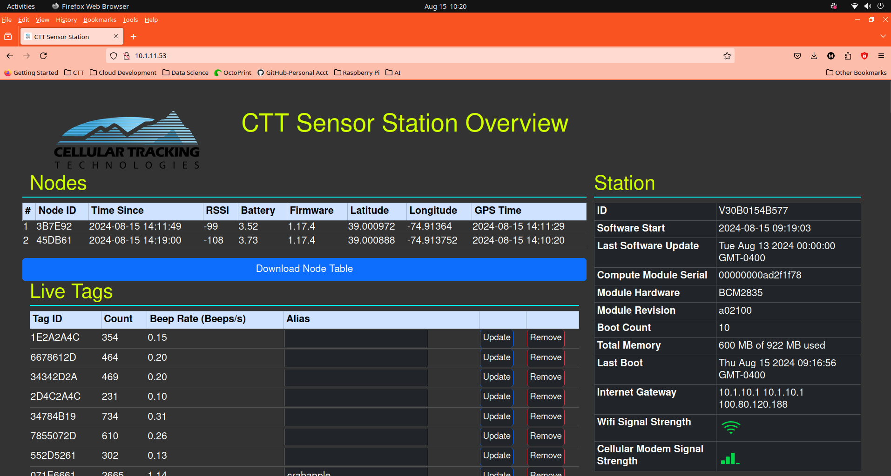
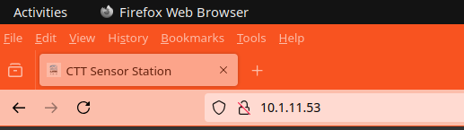
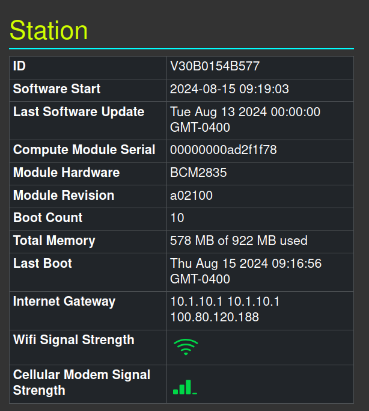
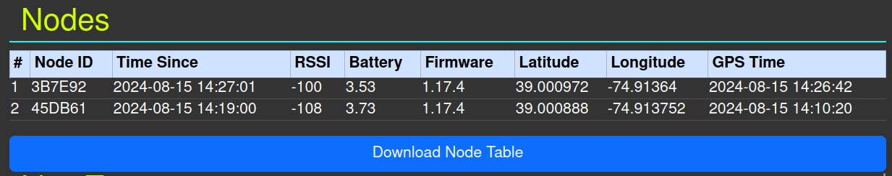
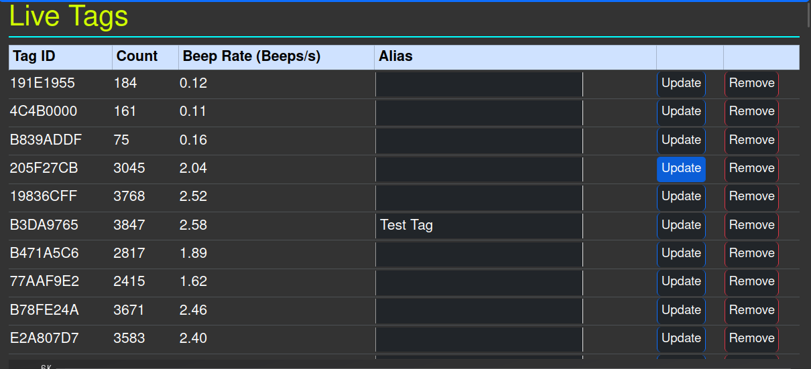
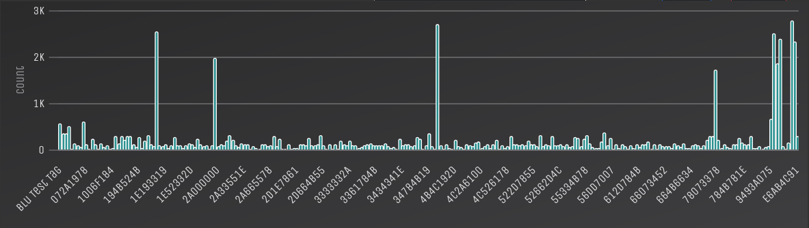
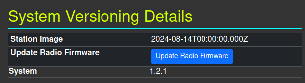
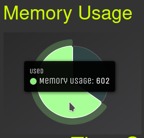

```{r setup, include=FALSE}
knitr::opts_chunk$set(echo = TRUE)
```

# Main Web Interface

{#id .class width=100%}

This is the main web interface page you see when you type either type in the IP address or "sensorstation.local" into your web browser.

This documentation will go over each part of the web interface.

## URL

{#id .class width=100%}

The IP address or hostname (sensorstation.local) will appear here. If you are connected to WiFi or Ethernet, you should be able to access the IP address from any device (laptop computer, tablet, smartphone, etc.)

* If you have a point to point connection (P2P) or are sharing WiFi over ethernet, then you can only access the IP address from the device that is connected to the station.

## Station Info
{#id .class width=100%}

On the right side of the webpage is a table containing all the details about the individual station

* ID - unique ID given to the SSTn board. If you swap the Raspberry Pi (RPi) compute module between different SSTn boards, the ID will change to the respective SSTn board. From IMEI.

* Software Start - the last time the SSTn started. Time is currently in UTC

* Last Software Update - the last time the software controlling the SSTn was updated. CTT developers are continuously updating and adding new features to the software so it is important to update frequently

* Compute Module Serial - unique ID for the compute module. This will change when you swap out the compute modules

* Module Hardware - the processor on the RPi compute module

* Module Revision - the compute module’s hardware revision

* Boot Count  - the number of times the system has been booted

* Total Memory - the amount of RAM currently being used by the system

* Last Boot - datetime of last boot in UTC

* Internet Gateway - device that SSTn is connected to connect to the internet (WiFi router, modem, p2p connection, etc.)

* WiFi Strength - visual indicator of WiFi signal strength

* Cellular Modem Signal Strength - visual indicator of modem signal strength

## Nodes Table
{#id .class width=100%}


Table displaying the CTT Nodes detected by the SSTn since connecting. For every Node it lists:

* '#' - individual Node Number

* Node ID - individual Node ID

* Time Since - the time of the last health report

* Node RSSI - the RSSI of the Node signal in decibels

* Battery - the Node's battery voltage, which can be used to estimate the remaining battery life.
  * 4.2 V is very full
  * 3.5 V is low
  * 3 V is nearly-empty

* Firmware - firmware version. Note that the v3 Nodes do not have a firmware value; this cell will appear blank

* Latitude - Node latitude in decimal format

* Longitude - Node longitude in decimal format

* GPS Time - time recorded on the Node, based on the built-in GPS

## Live Tags
{#id .class width=100%}
Note that tag ‘B3DA9765’ has an assigned Alias ‘Test Tag’.

# ```{r external-image, fig.cap = "Note that tag 'B3DA9765' has an assigned Alias: 'Test Tag'"}
# 
# ```

List of unqiue tags (PowerTag, LifeTag, HybridTag, BlūTag) that the radios detected since opening the Web Interface. The table includes:

* Tag ID - unqiue 8-digit digital ID

* Count - number of beeps since last page refresh

* Alias - for convenience, a name can be given to a particular tag and saved in the browser by hitting the ‘Update’ button. This information is saved in your browser only. Name it whatever you would like.

  * For example, it is great for keeping track of test tags when initially setting up your station

* Update Button - save the name of a particular tag to your browser

* Remove Button - reset the saved name

## Tag Histogram
{#id .class width=100%}

For stations running FunCubes or other 166MHz radios, you may need to disable the WiFi module for the radios to work properly.

## System Versioning Details

{#id .class width=100%}

Provides details about the station firmware

* Station Image - Datetime that refers to the firmware version

* Update Radio Firmware - update the 434 MHz Radios (the radios built into the SSTn) to the latest radio firmware (current firmware is v4)
  * when you click this button the 434 MHz radios will stop collecting data. The red light for each radio will be periodically solid for a time; this indicates that the firmware for the radio is being updated.

* System - Version of the station image software

## Memory Usage
{#id .class widht=100%}
Used - light green slice of the pie. Move the cursor to this portion to show RAM currently being used in megabytes (MB).

Pie chart indicating amount of system RAM currently being used

### Modem Model
To obtain the cellular modem model name:
: ```mmcli -m 0 | grep -a "model"```

### Modem model name
To obtain the Modem International Mobile Equipment Identity (IMEI):
: ```mmcli -m 0 | grep -a "imei"```

### Modem Carrier Information
To obtain the modem carrier information:
: ```mmcli -m 0 | grep -a "operator name"```

### Modem Signal Quality (%)
To obtain the modem signal quality:
: ```mmcli -m 0 | grep -a 'signal quality'```

### Enable Cell Modem:
For stations running FunCubes or other 166MHz radios, you may need to disable the modem module for the radios to work properly.

To enable the cell modem:
: ```/bin/bash /lib/ctt/sensor-station-software/system/scripts/enable-modem.sh```

### Disable Cell Modem:
To disable the cell modem:
: ```/bin/bash /lib/ctt/sensor-station-software/system/scripts/disable-modem.sh```

## System
### Update 434 MHz Radios to current firmware
To update the 434 MHz radios:
: ```sudo program-radios /lib/ctt/sensor-station-software/system/radios/fw/ss_v4.0.0.hex```

### Station ID
To obtain the station ID:
: ``` cat /etc/ctt/station-id```

### Station Image
To obtain the station image version:
: ```cat /etc/ctt/station-image```

### Real Time Clock (RTC) Time
To obtain the station time based on the RTC:
: ```sudo hwclock -r```

### Restart
To restart the station:
: ```sudo reboot```

### Bash Update Station
To update the station with a bash script:
: ```bash bash-update-station```

### Hostname
To obtain the station hostname
: ```hostname```

### Memory (RAM)
To display the total, used, and free memory: 
: ```free -h```

### Disk Space
To display the disk space usage:
: ```df -h```

### Uptime
To display how long the station has been running:
: ```uptime```

### Ping
To ping the station server:
: ```ping 8.8.8.8```

## Run the LCD commands from the Terminal

If your LCD screen is not working properly, you can still access most of the information displayed by the LCD screen by accessing the station hardware server from the terminal window. First, change the working director to:
: ```cd /lib/ctt/sensor-station-software```

Then, run the following line of code:
: ```npm run lcd-option command```

Replace the word command with one of the words from the list below. For example, if you want to get the battery and solar voltages from your Sensor Station, run:

```npm run lcd-option voltage```

and you will get a JSON object with the respective voltages:

```json
{
   "battery" : "11.61",
   "rtc" : -1,
   "solar" : "0.10"
}
```
Commands:
: * reboot_schedule_info
* gps
* station_id
* about
* node_version
* gateway
* status
* enable_wifi
* disable_wifi
* pending_upload
* wifi-networks
* modem_info
* get_ppp
* peripherals
* program_radios
* qaqc
* config
* checkin
* temperature
* voltage
* details
* usb_drive
* usb_mount
* unmount_usb
* download_data
* upload_wifi
