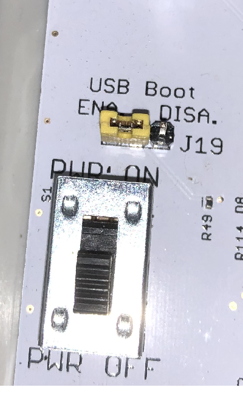
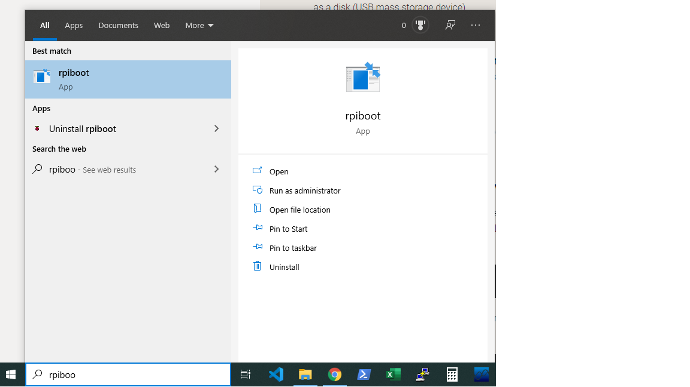
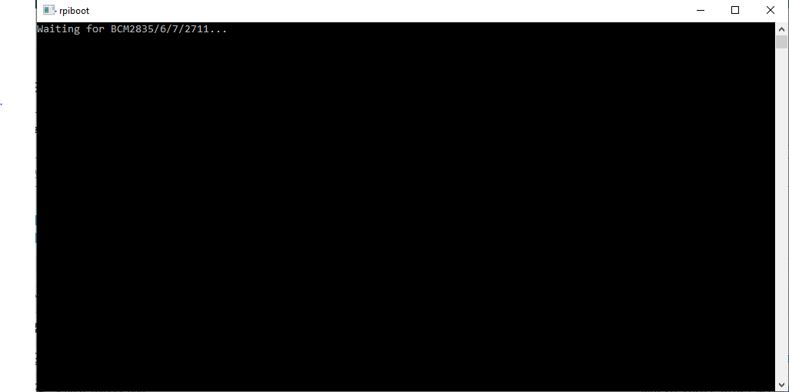
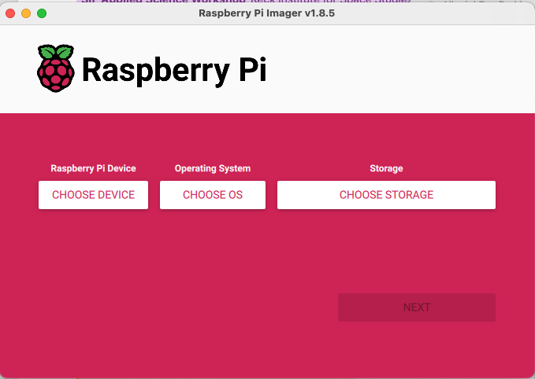

```{r setup, include=FALSE}
knitr::opts_chunk$set(echo = TRUE)
```

# Updating your SensorStation's Disk Image

You can use your `CTT SensorStation` to burn a new operating system onto the compute module using a micro USB cable attached to your computer. Here is an article on Raspbian's website with general instructions: [Flashing the Compute Module eMMC](https://www.raspberrypi.org/documentation/hardware/computemodule/cm-emmc-flashing.md). This page will summarize the steps needed to burn a New CTT SensorStation image to your compute module using the SensorStation hardware.

## Why flash my compute module? 

While CTT offers many over-the-air updates to your `CTT SensorStation` sometimes you just need a fresh start, or maybe you haven't been incrementally updating the source code and want to do so after a full stable release. You've found the right place to learn how!


***

## SensorStation Image Downloads

**If you are running a V2 or V3 SensorStation, you will want the Long Term Stable image right below this text.**

### **V2 & V3 SensorStation Long Term Stable (LTS) Image**
*Records Tag, GPS, SensorGnome, and Telemetry data. Compatible with BlūSeries Receiver and all BlūSeries infrastructure including V3 Nodes (with V4.0.0 or later Radio Firmware)*

[Download Current LTS Disk Image](https://s3.amazonaws.com/media.celltracktech.com/sensor-station/images/sensor-station.latest.xz) (**Version ID: 1.3.0 Updated: 2024-09-10**)

*This version is required if you are using the V3 version of the CTT Nodes, or the CTT BlūSeries Receiver.* **Note that you will also need to update your radio firmware to v4.0.0.** This is the default firmware for this disk image release. The radio firmware can now be updated directly from the LCD screen or the SensorStation Interface. **The Changelog can now be found here:** [changelog.json](https://raw.githubusercontent.com/cellular-tracking-technologies/sensor-station-software/lts_24-06.iso/changelog.json)


### **Old and Depreciated Disk Images**

#### **V1 SensorStation Disk Image**
*OTA Update enabled. Station health reports. RTL-SDR support. Pickup new Nodes / Tags with updated protocol.* 
[Download Station Image](https://d25eksygu9dzud.cloudfront.net/sensor-station/d7522108-017e-11ea-86b6-784f43a7974d/sensor-station.2020-03-23.zip)

#### **V2 and V3 SensorStation Disk Image**
[*05-01-2023 Disk Image*](https://s3.amazonaws.com/media.celltracktech.com/sensor-station/images/sensor-station.2023-05-01.zip) **Replaced by `Version 1.2.2 08-23-2024` linked above** **Default radio firmware for this older LTS image is v3.0.1 and is not compatible with CTT Node V3**.


***

## Software Requirements

You will need drivers for your computer to recognize the module as a new drive, and software to burn new images to disk.

### All Users

* All users require software to burn an image such as [Raspberry Pi Imager](https://www.raspberrypi.org/downloads/) or [balenaEtcher](https://www.balena.io/etcher/)

### Windows Drivers

* Drivers - Download and run the [Windows Installer](https://github.com/raspberrypi/usbboot/raw/master/win32/rpiboot_setup.exe) which will install the `rpiboot.exe`.

### Linux / Mac

Linux / MAC users will have to clone the rpiboot source code, compile and run the rpiboot.exe file that is generated. Detailed instructions for **Linux** [here](https://www.raspberrypi.org/documentation/hardware/computemodule/cm-emmc-flashing.md).

For **Mac**, follow these directions:

1. Install `Homebrew`, which is a package installer for **Mac**. 
    - Directions here: https://brew.sh <br>
    - Or you can paste this code into `Terminal`:

```
/bin/bash -c "$(curl -fsSL https://raw.githubusercontent.com/Homebrew/install/master/install.sh)"
```


Then install the libusb libraries:

```
brew install libusb
```

2. From within Terminal, navigate to your preferred directory. 

*Tip: I tend to use Dropbox, so I use the `cd` command to **c**hange **d**irectory into my `Dropbox` folder: ```cd Dropbox```*

Once you are in your preferred directory, run the following code to install the USBBoot code in `Terminal`

```
git clone --depth=1 https://github.com/raspberrypi/usbboot
```

Then move into the `usbboot` directory:

```
cd usbboot
```

Now make the `rpiboot` installer:

```
make
```
At this point, you now have a standalone executable called `rpiboot` in the `usbboot` folder. You can move that executable anywhere you want so it's convenient for using again in the future.

Additionally, once you have moved the `rpiboot` executable, the `usbboot` folder can be trashed as its contents are only useful for making the `rpiboot` program. **From now on, if you need to flash more compute modules, you can start with running `rpiboot` and do not need to re-do steps 1 and 2 above.**

If you are still in the `usbboot` directory, you can now run run rpiboot with the following command. Otherwise use the `CD` command in `Terminal` to change directory to wherever you moved `rpiboot`.

```
./rpiboot
```

At this point you should see a message in your terminal that says something to the effect of: 

`Waiting for BCM2835/6/7/2711...`

This indicates that the USB port has been opened, and your computer is waiting to see a Raspberry Pi on that port. **Now complete Steps 1 and 2 below, and skip steps 3 and 4.**

***

## Steps to Burn a New Image

1. Ensure the SensorStation power is turned `OFF`
2. Ensure the **USB Boot Jumper Pin** is in the `ENABLED` position (to the `left` 1 pin, for horizontally placed pins, or `down` 1 pin for vertically placed pins). We ship most stations with the pin in the `ENABLED` position, but if it's not, then go ahead and move it.

* *Note: The location of your USB Boot Jumper may vary, and is typically vertically placed near the lower left corner of the Raspberry Pi module on V1 boards, or horizontally placed just above the power switch on V2 boards.*

{#id .class width=25%}

3. Run `rpiboot.exe` which was installed from the previous step. From windows, you can search `rpiboot` to find it.

{#id .class width=50%}

4. Running `rpiboot` will pop up a console showing a wait message waiting for the module to be detected: 

{#id .class width=50%}

**WARNING: Your Windows machine may give you warnings stating to format the RPi Module. YOU DO NOT NEED TO DO THIS! Ignore these messages and continue onto step 5.**

5. Plug the micro-USB cable into the SensorStation, and into your computer.
6. Power on the SensorStation.
7. The dialog box from `rpiboot` should disappear after displaying some messages and the module will be available as a new hard drive. (**Do not auto-fix as windows may suggest!**)
8. Run `Raspberry Pi Imager`

{#id .class width=50%}

9.  for `Raspberry Pi Device` you can just leave it as-is.
10. Click the button under `Operating System` and scroll down to the very bottom to `Use Custom`. Click on it and choose to the SensorStation image file you saved (it's a `.zip` or `.xz` file), and select it.
11. Click the button under `Storage` and select your Raspberry Pi compute module as the target. `example: RPi-MSGD- 0001 - 7.8 GB`
12. Click the `NEXT` button.
13. If asked about applying OS customization settings, choose `NO`; if asked whether it's okay to erase the disk, choose `YES`. At this point the flashing should start.
  *   This will take a while, but once the image is written you will get a success message and the process is complete. 
13. Move the **USB Boot Jumper Pin** to the `DISABLED` position (to the `right` 1 pin, for horizontally placed pins, or `up` 1 pin for vertically placed pins). 
14. Restart your SensorStation, connect to the station via ethernet, and open the SensorStation Interface. 
15. If needed, update the radio firmware to the latest version, either via the web GUI or through the LCD menu. Once updated, confirm all five 434MHz radio have taken the radio update from the SensorStation Interface.

*_Of course, as always, if you have any issue please don't hesitate to email us at support@celltracktech.com._*
