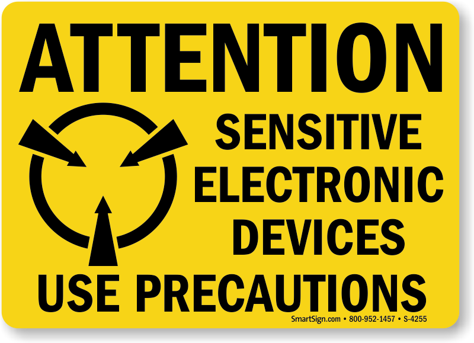

# Getting Started {#getting-started}

## Join us in our **Slack** User Community {-}

We now have a `Slack` workspace dedicated to CTT users. Topics range from station logistics to study design, and from data management to current development of novel analytic tool. Come be a part of the discussion and engage with other users as we push the boundaries of remotely sensed telemetry data!
[Click here](https://celltracktech.com/pages/csd-request-to-join-our-support-slack-community) to request access to our free and vibrant Slack workspace.

## Congratulations {-}

If you are reading this document, then you most likely have purchased one of our Internet of Wildlife (IoW) components. Whether you're doing localized detailed studies of small mammals or songbirds, or you're setting up SensorStations as part of the global Motus Wildlife Tracking System (motus.org), or you're doing something in-between, we've got you covered, and this document is meant to help you get started quickly and painlessly. If for some reason you get stuck along the way, please don't hesitate to reach out to us directly either via email (support@celltracktech.com) or through our online Help Desk here: [https://celltracktech.com/support/](https://celltracktech.com/support/).

## Participating in the Motus Wildlife Tracking System {-}

If you are setting up your SensorStation to participate in the Motus Wildlife Tracking System (motus.org), your station can still be used with CTT Nodes. In general, we recommend Motus stations to include 4 Yagi 10-element antennas pointing in the 4 cardinal directions. A fifth Omni antenna can be installed and dedicated to detecting nodes, or one of the Yagi antennas can be used for nodes while the other three are positioned at 120 degrees for full coverage.  You may also add any number of 166MHz antennas by using a Software Defined Radio (SDR), such as a FunCube or RTL-SDR, via any of the USB ports on the SensorStation (SDRs are sold separately via third-party companies). A clear view of the horizon is preferred to get maximum range, so a height as high as possible is also advised. For more information on Motus, see [Appendix I](#appendix-motus).

## SensorStation Precautions {-}

Treat your SensorStation board like you would any other motherboard, Arduino or Raspberry Pi. All electronics, no matter how robust, can be static sensitive. Take care no metal objects touch the board while it is operating, such as antenna connectors or cellular antennas, as this could cause electrical shorts that will damage the board. It is advised to wear an anti-static bracelet when handling SensorStation.

{#id .class width=25%}
