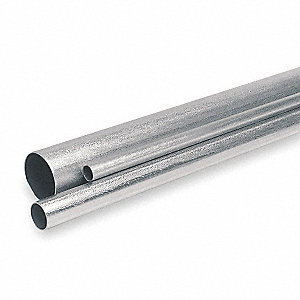
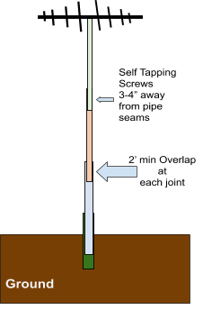
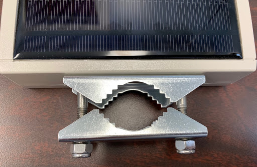
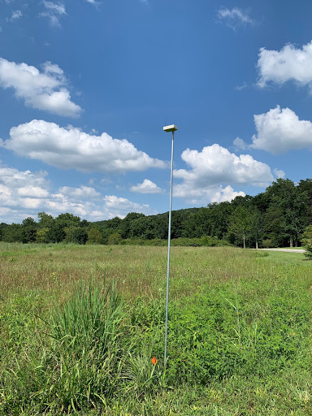
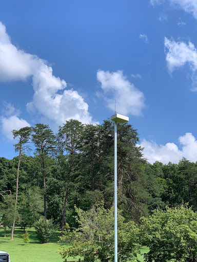
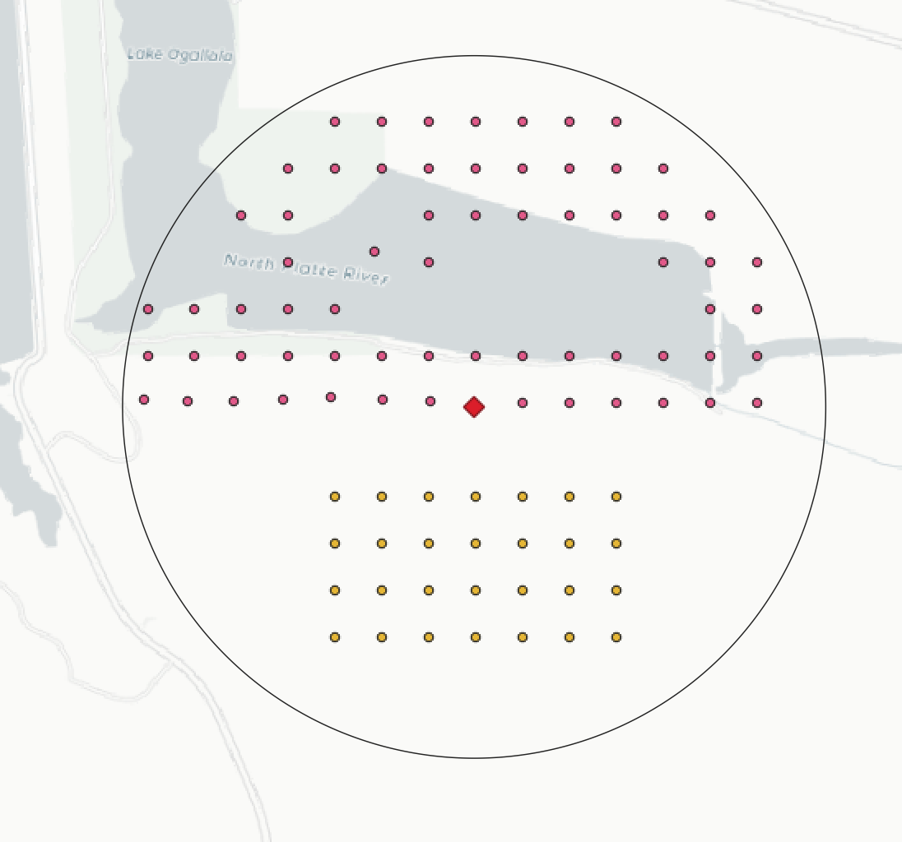
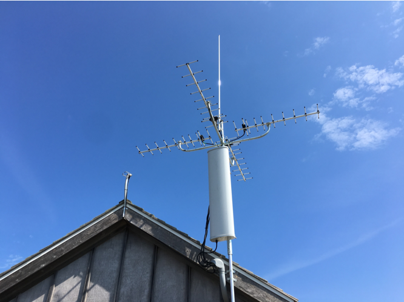
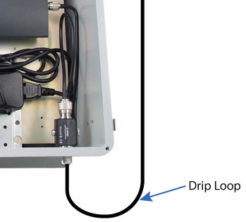
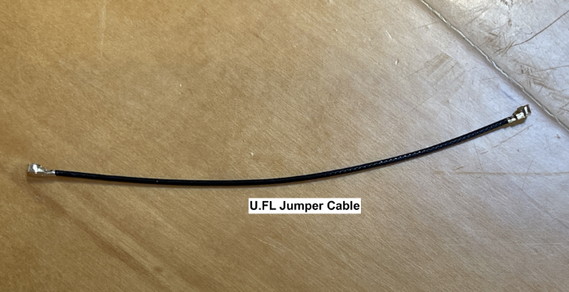
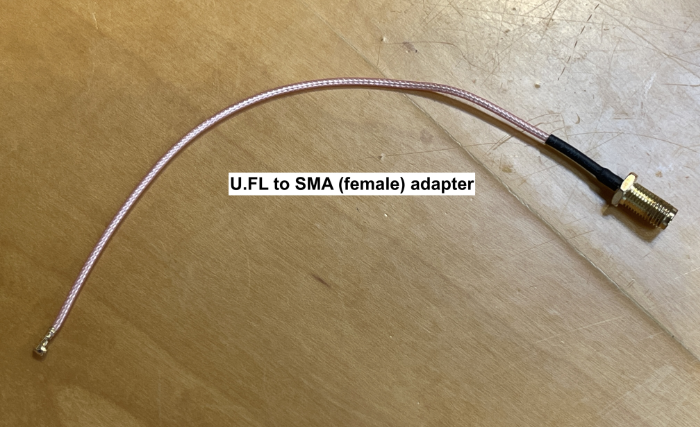

# Setting up your CTT IoW System {#system-setup}

CTT's Internet of Wildlife System (IoW) is a complete radio telemetry system that consists of transmitters (radio tags), and receivers. Currently CTT produces radio transmitters that communicate on two frequencies:

* 434MHz
  * LifeTag^TM^
  * PowerTag^TM^
  * HybridTag^TM^
* 2.4GHz
  * BlūMorpho^TM^
  * BlūBat^TM^

## CTT SensorStation

The **CTT SensorStation** collects data directly from tags and can collect data from a series of `Nodes` to more precisely locate tags within a study site. The `SensorStation` stores data and, with an optional cellular data plan, can also send those data directly to the CTT and Motus servers.

## CTT Node

**CTT Nodes** are essentially *mini-base stations*: devices with integrated solar panels, a lithium battery, and an antenna to collect data from 434MHz tags (V2 Nodes) or either 434MHz or 2.4GHz tags (V3 Nodes), and send those data to the **SensorStation**. These data can then be post-processed to localize tags within a grid of nodes over user-defined time steps.

## Understanding Detection Distances

The detection distance **from Node to Tag** varies for various reasons, including terrain, vegetation, and the behavior of the tagged animals. For instance, a bird flying overhead may be picked up over a kilometer away by a node, but one foraging in dense vegetation may only be detected from a few hundred meters. When using nodes for localization it's important to note that the accuracy of locations of animals wearing tags can be as little as 30m, but can range widely depending on the density of Nodes. For localizing tag positions, the spacing and placement of nodes must allow for tags to be detected simultaneously by three or more nodes.

The detection distance from **SensorStation to Node** is also affected by terrain and vegetation, but also antenna height and type (omni-directional vs. directional). **Therefore, while there is no hard and fast rule, a good starting point is to keep your farthest node within 1km of the SensorStation.** The number of SensorStations needed for each system depends on the size of the study area. For instance, in a 2 KM^2^ plot, a SensorStation placed at the center of the plot could detect nodes across the entire study area, in most cases with only an omni-directional antenna. Because `Nodes` are dependent on the SensorStation to receive their data and aggregate it for analysis, it is critical to ensure each node is within the detection radius of at least one `SensorStation` at all times.

The detection distance from **SensorStation to Tag** is affected by the same factors as SensorStation to Node, but because many tags are on birds, bats and insects, the relationship between the two objects can change drastically over very short time steps. With line-of-sight, a tag on a bird has been shown to be detectable for **dozens of kilometers** by a SensorStation. On the other hand, birds foraging in dense vegetation may only be detectable by a station within a few kilometers. Therefore, careful consideration of station position with relation to the biological questions being asked is critical for a successful deployment.

## SensorStation Installation Example {#installation}

### Materials

* **Compatible Test Tag**
* **Nodes (each)**
  * 1 x Node box
  * 1 x Antenna
  * 1 x Clamp hardware
  * 1 x  ¾" EMT conduit

* **SensorStation**
  * 1 x SensorStation
  * 1 x Enclosure
  * 4 x SensorStation Screws:  #8-16 X ¼ phillips self tapping screws for plastic:
    https://www.mcmaster.com/99461a330
  * 1 x Power cable
  * 1 x Omni Antenna
  * 1 x Coax cable

* **Mounting hardware**
  * 10' long  1'' EMT conduit
  * 10' long  1 ¼'' EMT conduit
  * 10' long  1 ½'' EMT conduit
  * Tripod
  * Clamp for attaching SensorStation to conduit
  * Tap screws
  * zip ties
  * coax tape

* **Optional**
  * colored electrical tape for color-coding antenna wire ends

### Mounting your Equipment

For both the SensorStation and Nodes we recommend attaching to **EMT conduit**.  We recommend this because it is rigid and easy to set up. This is *not* what's commonly referred to as *Black Pipe* used for water and gas lines, but the **galvanized steel pipe** used for running electrical wiring inside.

{#id .class width=25%}

### Building a Mast for your SensorStation

**We don't recommend PVC** because it moves in the wind, becomes brittle, and will snap over time. EMT can be painted if you would like them camouflaged.

The conduit can be attached to a tripod, mounted directly into the ground, or onto a building or other structure. The Nodes and SensorStations are then attached to the conduit. The diameter of the conduit is typically 1" for the top mast section of the SensorStation (the section to which the antennas are attached; light green in the picture below).

{#id .class width=25%}

For every 7 feet of height the base section will increase in diameter by ¼". For example, in the picture above, a 15 foot mast will have a 1" section (light green) inserted into a 1 ¼" (orange) and then into a 1 ½" (blue). If the conduit is inserted into the ground, the 1 ½" conduit should be inserted into a 4' section of 2" pipe (dark green). The pipe in the ground is cut in half, the bottom flattened slightly with sledge hammer to keep soil from entering when it is driven into the ground. A block of wood can be used to pound the pipe into the ground to prevent bending the pipe.  If the antenna mast is shorter,  the next size up gets driven into the ground (1/ ¼"). Note that standard EMT conduit does eventually rust, however it will remain very strong for 6-10 years.

If desired, stainless conduit can be purchased, however it is much more expensive, but **recommended if you are in an area that receives high winds**. It is crucial to overlap each section of pipe by at least 2 feet. **Self tapping screws** are used to hold pipes together, but should not be used within 3-4" of the end of the pipes and/or seams. The chart below should help with what is needed for your setup per SensorStation.

| Total Approx Mast Ht.| EMT Needed for mast (10')| Ground Section Needed (4')| Coax Length Per Antenna |
| :------------------: | :----------------------: | :-----------------------: | :---------------------: |
|     7'               |    1"                    |     1 1/4"                |   min 10ft              |
|    15'               |    1",1 ¼"               |     1 ½"                  |   min 20'               |
|    23'               |    1", 1 ¼", 1 ½"        |     2"                    |   min 25'               |
|    28'               |    1", 1 ¼", 1 ½"        |     2"- Use full 10'      |   min 30'               |

***Masts higher than 28' not recommended with standard free-standing EMT conduit. Guy wires and/or scaffold or tripod masts are other options for higher towers.***

### Mounting Nodes

Nodes are typically attached to the top of a ¾" piece of EMT. The clamps shown below come standard with the nodes and accept ¾ or 1" conduit.

{#id .class width=25%}

A 7/16" socket is used to tighten the clamp bolts. The EMT is typically driven into the ground approximately 2 feet. The height of the nodes can be changed depending on the project, but for best results should be consistent within a study site. We recommend 8' for most setups, see below for pictures of the node setup in the field. If you choose an alternate mounting method, care should be taken that they are secure. If they are mounted on anything that sways greatly with the wind, the readings won't be consistent.

{#id .class width=25%}
{#id .class width=25%}

**Note:** ***Nodes purchased in 2020 and beyond have a built-in GPS. Prior to 2020 you must take accurate GPS readings and record that data with the Node ID in order to run post-hoc localization analyses.***

## Node Placement

Setting up the CTT Nodes is typically done in a grid in your study site. It is not imperative that they are exactly in a grid, but the closer you can set them up in a grid, the more accurate positioning you will get from the tags. In sites where this is not practical, you can simply set them up where you can, 50-200m apart, and record GPS of the Node locations. Even in a grid setup, it is best practice to take GPS coordinates whether or not they differ from the layout. Nodes should be placed above surrounding vegetation (to ensure solar recharging of the internal battery) or at least 2.5 meters above the ground.

## SensorStation Placement

If you are using Nodes, your SensorStation may be placed anywhere within range of the farthest node, which is typically 1km. See the next section on SensorStation Configuration and Antenna Detail for more details on this. It is recommended to place the SensorStation antennas at least 10 meters above the ground level. The higher the antennas, the better range you will get.

{#id .class width=25%}

## SensorStation Configuration and Antenna Detail {#antenna-detail}

The standard configuration for the CTT SensorStation allows for receiving data on *five 434MHz* radio ports simultaneously. These can be configured to either record signals from LifeTags/PowerTags/HybridTags and ES-200 GPS loggers (hereafter "tags"), or to collect data from CTT Nodes. **Tags and Nodes cannot be picked up on the same channel simultaneously**, and how you configure your station depends on your study goals. The number of channels necessary on a SensorStation depends on the number of Nodes, whether you want to detect tags/transmitters and/or Nodes directly with the SensorStation, and the distance the Nodes are from the SensorStation. There is no hard limit to the number of nodes that can be detected by a single SensorStation, but it's best to keep that number around 50 or less. *Distance to the SensorStation will usually be the limiting factor for the number of nodes detectable by a single SensorStation.*

Two types of antennas are commonly used with the SensorStation: *Omnidirectional* and *Yagi*. *Omnidirectional antennas* efficiently receive energy in a *horizontal plane 360 degrees around the SensorStation*. Omnidirectional antennas typically do not have as great a range as Yagis, but a benefit is the 360 degree detection, and great detection of tags and nodes that are near the station.

**Note: Whereas in the past we have recommended specific polarization for omnidirectional antennas picking up Nodes vs. Tags, in our testing we have found the difference negligible and find vertical omni antennas to be much simpler and less expensive for a greater value over horizontally polarized omnis.**

*Yagis are directional antennas* used to detect tags and nodes in a specific direction from the SensorStation. They *typically have a 30-60 degree detection range that extends away from the SensorStation*. For that reason typically 2-4 antennas are used, one pointed in each cardinal direction, or two pointed in opposite directions and used to make a "fence". Yagis can also be used to pick up Nodes that are farther away from the SensorStation.

{#id .class width=25%}

While there are many antennas to choose from, these are a few that we can recommend from experience:

  * Omni-directional
    * [Data Alliance A433O5](https://www.data-alliance.net/antenna-433mhz-5dbi-omnidirectional-fiberglass-w-n-male-vhf-uhf-marine/)
      * and you'll need [this bracket](https://www.data-alliance.net/l-mount-for-antenna-pole-or-wall-mount-hole-for-n-female-or-rp-sma/)  
    **Make sure you choose to include the U-bolt and set screws and choose the version for Type N female connector**
      * and [this adapter](https://www.data-alliance.net/n-type-female-to-female-coupler-adapter-w-o-ring-weatherproof-bulkhead/)  
    **Make sure you choose the adapter with the Type N bulkhead with O-ring!**

  * Yagi
    * [M2Inc 440-6SS](https://www.m2inc.com/FG4406SS)
    * [Laird YS4306](https://www.mouser.com/ProductDetail/Laird-Connectivity/YS4306?qs=EU6FO9ffTwelQ7%2FXOHiHew%3D%3D)
    * [Diamond A430S10](https://www.hamradio.com/detail.cfm?pid=H0-005816)
    * [Diamond A430S15](https://www.dxengineering.com/parts/dmn-a430s15) *for specialized applications where longer-range is required

*__Whatever you choose, make sure you get the proper coaxial end to connect your antenna to your SensorStation!__*

{#id .class width=25%}

### Connecting Antennas to your SensorStation

To connect antennas to your SensorStation you will need coaxial cable (we recommend LMR-400 or better) with the proper ends to connect to the antenna (manufacturer specific) and your SensorStation. If connecting directly to the board, each 434MHz radio has a **SMA Female** port, so your coaxial will require an **SMA Male** connector.

If connecting to our NEMA case, your coaxial will need a **Type N Male connector**.

If connecting an antenna for a different frequency, such as 166MHz, you will need to attach your Software Defined Radio (SDR) to one of the USB ports and your coaxial cable to the SMA connector on the SDR. Note that any 166MHz radios will only show up in the SensorGnome section of the Web Interface (see **Sensor Station Web Interface**).

### Mounting the Antennas

Antennas are attached to the EMT conduit with the clamps that come with the antennas. If you have a setup that uses 4 yagis, than you will attach the yagis to a 4 or 5-way mounting "hat" you can purchase via online retailers.  Once the antennas are on EMT, attach the coax and wrap the connection with coax tape. Run down the poles to where it will attach to the SensorStation. You can use zip ties to secure the coax to poles where needed.

{#id .class width=25%}

Make sure you have enough coax to form a drip loop for each connection.

{#id .class width="25%"}

### Adding an Optional LTE Extender

If you are using our on-board LTE modem for sending data to the cloud and to Motus, and you are finding you have a weak signal at your station site, you can add an optional cellular antenna to increase the range of your station transmission to the cell network. CTT does not sell cell booster antennas, but many are available on Amazon.com. Here is one example, but note that we have not tested this specific device; it's simply to provide some idea of what might work: https://www.amazon.com/Directional-Universal-Cellphone-Amplifier-Signalbooster/dp/B089VXJV14/ref=sr_1_3?crid=L0H9JNP4DRQF&dib=eyJ2IjoiMSJ9.DwK2pym6t2RcsY6MY5SFAx_HO7CFELHCiEedhErb9Ib08Fv5Z512JpCcNzW5TUtQoA8dZItS8yOJAajf3bikFw.te4gjK0B-7qty7WuY-_NLxslPGjxqqpMRtLonWDJQOI&dib_tag=se&keywords=LTE+yagi+booster&qid=1704994609&sprefix=lte+yagi+boos%2Caps%2C133&sr=8-3

Typically, these cell booster antennas have an SMA male connector that needs to somehow attach to the SensorStation board to communicate with the modem. We have provided a SMA port on the board near the LTE modem, labeled `J7`. That port is not activated without first *jumping* the U.FL port on the modem labeled `main`, to the U.FL port labeled `J6` on the SensorStation board. In doing so, you will activate the `J7` SMA port on the board which will allow you to attach the SMA connector on the cell booster antenna to said port *(see fig below)*.

Alternatively, you could attach a `U.FL to SMA adapter` *(see fig below)* directly to the `Main` port on the modem, and connect the SMA connector on the booster cable directly to the adapter, bypassing the need to jump to the board and not using the SMA port on the board itself. This option might be preferred if you use a U.FL to SMA bulkhead, which you can mount to the side or bottom of your case, allowing you to create a weatherproof access point to connect an external antenna to the outside of your SensorStation case.

{#id .class width="50%"}

{#id .class width="50%"}

{#id .class width="50%"}

* `Pink circle`: `Main` `U.FL` port on LTE modem (currently occupied)
* `Blue rectangle`: `J6` `U.FL` port on board
* `Red square`: `J7` `SMA` port on board

{#id .class width="50%"}

{#id .class width="50%"}

{#id .class width="50%"}

### Siting your SensorStation

The SensorStation can be placed inside a building, or fastened to the pole or building, etc. It should either be close to the ground for easy access, or have an ethernet cable run down to an accessible location.

#### GPS Reception

**If placing your station inside a building be aware that this may affect GPS and/or cellular reception, possibly requiring an external antenna wired to the outside of the building.** There are many possible external antennas, and searching Amazon for "external GPS antenna with SMA connector" will yield a number of options.

##### Activating an External GPS Antenna

Your SensorStation ships with the onboard GPS chip-antenna activated. There is a small jumper near the GPS that must be moved into the disabled position to deactivate the chip antenna and activate the SMA port on the board. After moving the jumper, you can attach your external antenna to the SMA port and it will work. Be sure to confirm operation by witnessing a good GPS fix on the LCD, or via the web interface, before leaving your SensorStation.

#### Adding an Iridium Antenna for Iridium-enabled Stations

Iridium satellite stations will require an external antenna. Typically, our customers will make use of a Taoglas IMA.01.105111. We can recommend Mouser.com, as they offer a good price with reasonable shipping costs.

You will also need coaxial cable to connect the antenna to the SensorStation. Both are SMA female connectors, so an SMA to SMA male coax cable is required.

The iridium antenna itself uses a marine antenna mount thread. You will need a Marine Antenna Base, which looks like [this](https://www.amazon.com/gp/product/B01HX01DQE/ref=ppx_yo_dt_b_search_asin_title?ie=UTF8&psc=1).

We at CTT have used the one above for testing. There is a slot on the antenna that the coax comes out, which allows you to screw it down to the base securely. Please look for one that suits your antenna mast needs.

The antenna itself does not need to be up high. It just needs a reasonably clear view of the sky and to be outdoors. If the SensorStation GPS works, Iridium will likely also work. It is quite resilient even in less than ideal conditions.

Lastly, the coax will need to be connected to the SensorStation. There is a SMA connector next to the SensorStation's Iridium modem, and any stations shipped Iridium-ready will already include the jumper from the modem to the board to activate the SMA port.
