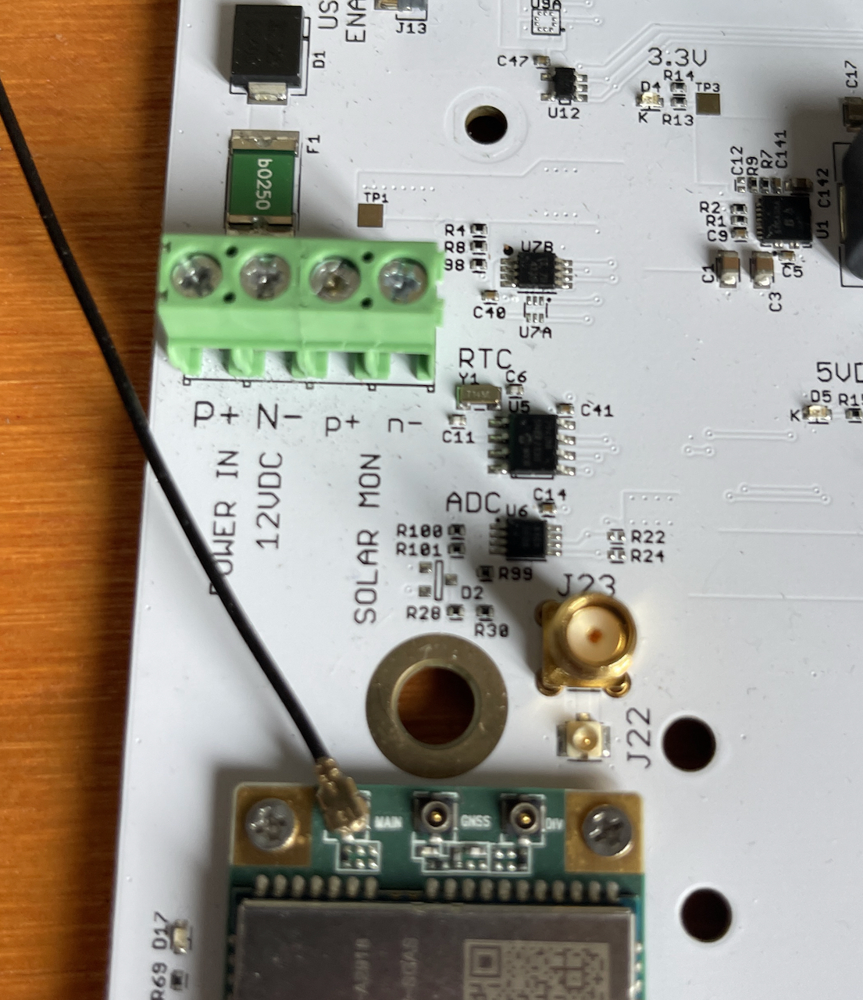
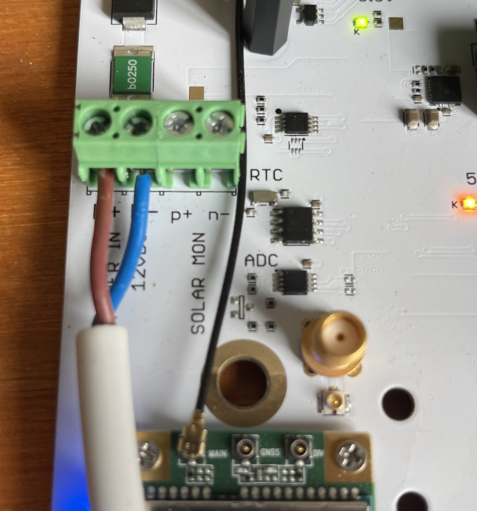
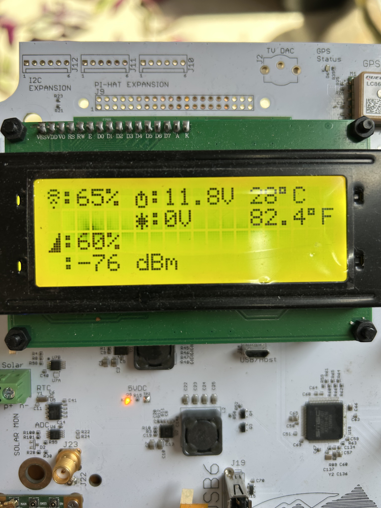
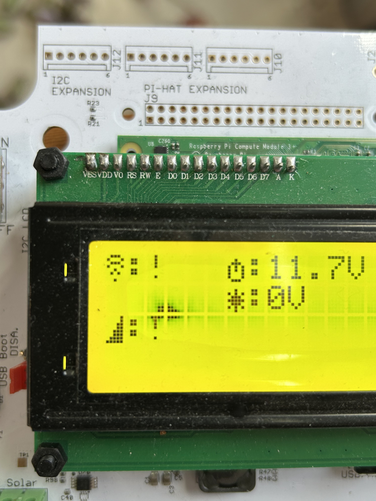

# Powering and Operating your SensorStation {#powering}

## Power Filter

{#id .class width="20%"}

CTT's new power filter dramatically improves radio tag detection by eliminating electrical noise interference.
With thousands of Sensor Stations deployed across diverse environments, we've observed that some sites suffer from significantly more electrical noise than others. This noise can come from power lines, solar panels, or other electronic equipment, and it interferes with your station's ability to detect radio tags.

The Problem: Long power cables (especially from solar panels) act like antennas, picking up electrical noise and feeding it directly into your sensor station. This noise drowns out the weak signals from radio tags, reducing detection range and reliability.

The Solution: Our power filter combines an RF choke and EMI filter to block this unwanted noise while allowing clean power to reach your station. Think of it as a noise barrier that stops interference at the source.

What You'll Experience:

* Detect weaker tags that were previously lost in the noise

* More consistent performance regardless of your site's electrical environment

* Better range and reliability in both noisy and clean locations

* Instant improvement - benefits are immediate upon installation

* Easy Installation: Simply plug the filter between your power source (solar, battery, or AC adapter) and your sensor station. No special tools required, no configuration needed - just plug in and experience cleaner reception immediately.

Whether your site currently has noise issues or not, every station benefits from improved signal-to-noise ratios that lead to better tag detection performance.

To receive your CTT Power Filter, fill out the form here:
https://airtable.com/app20NXPv7qjXDfBN/pagrBcK1muqejz5os/form
The form is password protected to keep out spammers. The password is celltracktech2025.

### Power Filter Attachment

The power filter is attached in-line between the power source and SensorStation power block.

1. Disconnect your power from the station board.

2. Plug in the power filter wires into the appropriate polarity on the station board (red to positive, black to negative).

3. Plug your power source wires into the power filter terminal, again ensuring that you're matching the polarity (brown with positive, blue with negative).

{#id .class width="20%"}

**If you have a V3.3 SensorStation**, the power filter is built directly into the board and you do not need to install an external one. You can proceed below.

## Powering your SensorStation

The SensorStation can be connected directly to a 12V DC power source, via a charge controller, or to an AC to DC power supply which can then be plugged directly into your standard AC power source. In many cases, though, SensorStations are deployed remotely and are in need of a remote power supply such as a solar charged deep-cycle marine battery. A typical setup would be a 100W solar panel connected to a charge controller. The charge controller typically has 3 ports. The 3 ports are 1.) Solar panel 2.) 12V battery 3.) Accessory/Device/consumer, which, in this case, is your SensorStation. That line goes into the green *Power In* terminal on the SensorStation board. The positive and negative wire ports are labeled on the board, and to insert the wire simply loosen the set screws on the top, and slide the wire leads in to the holes just under the set screws (see the pictures below; note for V1 stations see the QuickStart Guide in the Appendix).

{#id .class width="20%"}
{#id .class width="20%"}

The ends of the wires that are attached should be tinned with solder for best results. If you do not have access to a soldering gun, twisting the ends of the cables tightly will help them slide in cleanly to the power block.

## Monitoring your Solar Voltage

If you would like to monitor your solar voltage remotely, you will need to use the solar monitor connector. it is located above the on/off switch. Simply run two wires from the solar input of the charge controller to a two pin connector.

## Powering On your SensorStation

Once connected to power, flip the black switch left of the LCD into the `PWR ON` position. You will see a number of lights begin to flash during bootup and finally the LCD screen will display a menu which you can then access via the four buttons to the right of the LCD screen.

## SensorStation LEDs

There are several LED lights on the SensorStation which may assist you in diagnosing issues. Note that with the introduction of the SensorStation V2's LCD screen, all diagnoses can be carried out via the LCD. Take a moment to review each LED.

### Diagnostic A (green)

| LED Behavior  | Meaning | Troubleshooting Steps |
| :------------------ | :---------------------- | :----------------------- |
| OFF or SOLID | The software has stopped reading data from the radios and writing to the disk. | Restart your SensorStation. |
|   Blinking | The software is reading data from the radios and writing that data to disk.  | The system is operating properly. |

### Diagnostic B (red)

| LED Behavior  | Meaning | Troubleshooting Steps |
| :------------------ | :---------------------- | :----------------------- |
| ON| Indicates that the SensorStation has established a point-to-point protocol (PPP) connection between the network and the on-board cellular modem. | The SensorStation checks for the connection every second. The PPP connection is just the layer that allows the modem to communicate to the cellular network **if it is on**, but doesn't always indicate that a connection is working (such as in the case of a weak signal)  |
| OFF | Indicates that the SensorStation modem is not connected to the cellular network.   | If there is no modem on the SensorStation this would be the typical state and behavior. If a modem exists but this behavior continues, it indicates that the cellular modem is unable to secure a connection to the network. |

### Cellular LED (blue)

The blue LED by the cellular module, labeled D9, is called the Netlight. The Netlight blinks differently, depending on the modem state. You can use this blink rate to identify if your SensorStation is connected to the Internet or unable to connect.

| LED Behavior  | Meaning | Troubleshooting Steps |
| :------------------ | :---------------------- | :----------------------- |
| OFF | The modem is not currently powered on. | Check to make sure the Raspberry Pi is running. |
| Moderate blinking (5 times per second) | The modem is searching for a signal and is not yet connected to a network.  |   Wait a minute or two for the modem to find a signal. If it continues to blink, try using an external antenna or moving the SensorStation to a better location. Also, be sure that your SensorStation has a data plan and is activated.|
|Slow blinking (once every 2 seconds) |The modem is connected to the network but is idle.| |
|Fast blinking (8 times per second) |The modem is connected to the network and is transferring data. | |

## SensorStation Navigation Buttons

The SensorStation features 4 navigation buttons labeled `UP`, `DN`, `BACK` and `SELECT`. They are typically used with the SensorStation software to navigate the LCD display.

## SensorStation LCD Menu {#lcd-menu}

*Note that this menu may differ from the one on your current station, as there many new features were added to the BETA disk image. Most items should be described here, but the order may be different than you see on your station. In a few cases menu items are no longer informative on newer stations and we've attempted to denote that where necessary.*

- `Station Stats` - This image provides a quick glimpse of the station health, including whether WiFi (`r knitr::asis_output("\U1F6DC")`) is on, the Cellular Modem is on (`r knitr::asis_output("\U1F4F6")`), the Battery/Power level (`r knitr::asis_output("\U23FB")`), Solar Charging (if a solar monitor is connected) (`r knitr::asis_output("\U2600")`), and Temperature (`r knitr::asis_output("\U00B0")`C and `r knitr::asis_output("\U00B0")`F).

{#id .class width="20%"}

- `File Transfer`
	- `Mount USB` - mounts a properly formatted (FAT-32 or MS-DOS) USB drive to the SensorStation.
	- `Unmount USB` - un-mounts a properly formatted (FAT-32 or MS-DOS) USB drive from the SensorStation. This should be used before removing a USB drive from your SensorStation.
	- `Download` - downloads all data on the SensorStation to the mounted USB drive.
- `Network`
  - `IP Address` - Displays the port of connection and IP address assigned to the SensorStation. You can use the IP address to connect to your SensorStation using the same process outlined above under `Hostname`. For example, if the IP Address was 10.1.10.17, typing `http://10.1.10.17` into your web browser's URL field would bring up the SensorStation web interface.
  - `WiFi`
    - `Enable WiFi` - Enables the WiFi adapter
    - `Disable WiFi` - Disables the WiFi adapter. *If you are using a Cellular modem and running 4 or more FunCube dongles, you may benefit from disabling the WiFi to reduce USB traffic.*
      - **WARNING** If the wifi is disabled and you click this option again, it will produce an error message. To determine if the wifi is actually disabled, navigate to the `Station Stats` menu; there should be a `!` next to the wifi symbol (`r knitr::asis_output("\U1F6DC")`).
      - {#id .class width="20%"}
    - `Mount USB` - mounts a properly formatted (FAT-32 or MS-DOS) USB drive to the SensorStation.
    - `Get WiFi` - Loads the WiFi credentials from a USB Drive plugged into one of the USB ports. Note that the credentials must be properly formatted per the directions provided in this document.
  - `Cellular`
	  - `Enable Modem` - Enable the attached Quectel cellular modem.
	  - `Disable Modem` - Disable the attached Quectel cellular modem.*If you are using the WiFi module to send your data, and running 4 or more FunCube dongles, you may benefit from disabling the cellular modem to reduce USB traffic.*
  	  - **WARNING** If the cell modem is disabled and you click this option again, it will produce an error message. To determine if the cell modem is actually disabled, navigate to the `Station Stats` menu; there should be a `!` next to the cell modem symbol (`r knitr::asis_output("\U1F4F6")`).
        - {#id .class width="20%"}
	  - `Ids` -  - Displays the SIM ID, the IMEI, and the name of the Modem
	  - `Carrier` - Displays the cellular carrier name and signal strength of the connection, refreshing every 2 seconds. This may be useful when troubleshooting problematic cellular connections, and aiming an external cellular antenna (not included).
  - `Ping` - This will ping a known web address to determine whether an internet connection is present. If present, it will return **connected**.
  - `Hostname` - Typically this is `sensorstation.local` and can be used to reach your station when it is connected to WiFi, a local network via Ethernet, or directly to a computer via Ethernet. Once connected, simply navigate to http://sensorstation.local in your web browser to access the SensorStation interface.
- `System`
  - `Program Radios` - this command will program the five 434MHz radios to the latest firmware residing on the disk image.
  - `About`
    - `Image` - provides the image creation date, and the date of last update.
    - `Ids` - displays the `System Ids` which include the `SensorStation serial number` `SIM number` `Broadcom chip id` and `Raspberry Pi serial number`
    - `Memory` - displays the amount of used memory and the total disk size.
    - `Uptime` - Displays the total up time since the station was last rebooted.
  - `QAQC` - this is an internal function which will eventually be useful to the end-user but not as of this printing.
  - `Time` - The three clocks on the SensorStation, refreshing every two seconds. `r`eal time clock, `g`ps clock and `s`ystem clock.
  - `Restart` - Triggers a system restart.
  - `Bash Update` - Causes the SensorStation to check the CTT Update Server for any updates that have been assigned to the station. This is NOT the same as running Update Station from the SensorStation web interface. Requires an active cell or other internet connection.
- `Server` - causes the SensorStation to force a check-in to the CTT hardware server. Requires that the SensorStation is connected to the internet via either cellular, WiFi or Ethernet. Note that this process may take a long time depending on connection speed and/or amount of data being sent/received.
- `Power` - Provides voltages for `Battery` (which represents whatever power source is connected to your SensorStation), `RTC` or Real Time Clock, the coin cell battery on the board, and `Solar` if you have connected a solar monitoring cable from the charge controller to the SensorStation board.
- `Temperature` - (Eliminated on V3.02) Provides the temperature of the SensorStation board. Note temperature will usually be higher than ambient when the board is powered.
- `Location` - provides the Lat/Long for the SensorStation from the on-board GPS.
- `Languages` - toggle between Spanish, French, Portuguese, and Dutch

**Depreciated after Early V2**

  - `LED` - (V1 and V2 only) allows you to select various LED and toggle them `on`, `off` or `blink`.
  - `Diagnostic A` - this LED represents the connectivity to CTT servers.
    - `On` - Turns the LED `on`, if current state is `off`.
    - `Off` - Turns the LED `off`, if current state is `on`.
    - `Blink` - Blinks the LED once.
  - `Diagnostic B` - this LED represents the connectivity to the cellular network (if a cell modem is installed).
    - `On` - Turns the LED `on`, if current state is `off`.
    - `Off` - Turns the LED `off`, if current state is `on`.
    - `Blink` - Blinks the LED once.
  - `GPS` - this green LED has three states: Solid (3D Fix), Blinking 2x/second (2D fix), Blinking 5x/second (No Fix).
    - `On` - Turns the LED `on`, if current state is `off`.
    - `Off` - Turns the LED `off`, if current state is `on`.
    - `Blink` - Blinks the LED once.

