# The SensorStation Web Interface Explained {#interface}

## Accessing the Web Interface

1. Connect your SensorStation to the internet through Wifi or through an Ethernet connection.
  a. You can also connect to your SensorStation using a point-to-point connection (connecting to the SensorStation to your computer with an ethernet cable and a USB-ethernet adapter).

2. In a web browser like Google Chrome or Mozilla Firefox (avoid using Microsoft Edge), type in your Sensor Station's IP address (which you can find on the LCD screen) or entering the `sensorstation.local` hostname into the URL bar.

```{r sensorstation-url, echo=FALSE, fig.cap="sensorstation.local address in the URL bar"}
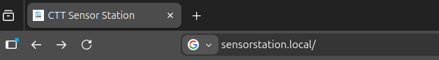
```

**Note:** If you have multiple SensorStations on one WiFi/ethernet network, the sensorstation.local hostname **will not work!** You will need to use the station's IP address in order to display the Web Interface.
## Nodes

```{r nodes-table, echo=FALSE, fig.cap="Nodes Table"}
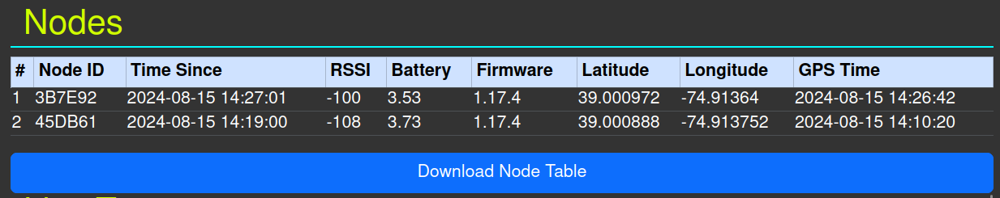
```

At the very top of the page you will see the header titled **Nodes**. This is a list of Nodes the station has detected since connecting. For each Node it lists:

* `Node ID` - ID of the Node that is connected to the SensorStation.
* `Last Heard` - the time of the last health report.
* `Node RSSI` - the RSSI of the Node signal in decibels.
* `Battery Voltage` - the Node's battery voltage, which can be used to estimate its remaining life. 
  * 4.2 V is very full. 
  * 3.5 V is low.
  * 3.0 V is nearly empty.
* `Node Firmware Version` - firmware version of the Node. Only available on the v2 Nodes.

## Live Tags

```{r live-tags, echo=FALSE, fig.cap="Live tags table"}
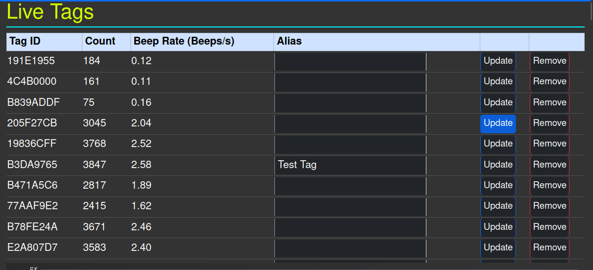
```

This is a list of unique tags (PowerTag, LifeTag or HybridTag) that have been detected by your radios since connecting to your computer. For each tag it lists:

* `Tag ID` - unique 8-character (4 bytes) digital ID.
* `Count` - number of beeps since last page refresh.
* `Alias` - for convenience, a name can be given to a particular tag and saved in the browser by hitting the `Update` button. This information is saved in your browser only. Name it whatever you'd like. Great for keeping track of particular tags during a test.
* `"Update" Button` - save the name of a particular tag to your browser.
* `"Remove" Button` - reset the saved name.

Below the Live Tag list is a histogram of tags detected since opening the interface. The bars indicate the number of beeps detected.

```{r tag-histogram, echo=FALSE, fig.cap="Tag histogram"}
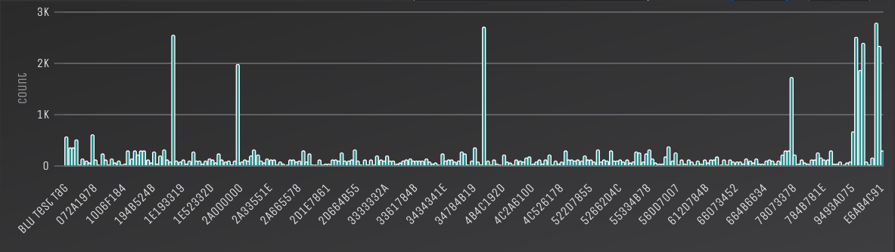
```

## Station

```{r station-section, echo=FALSE, fig.cap="Station Info section"}
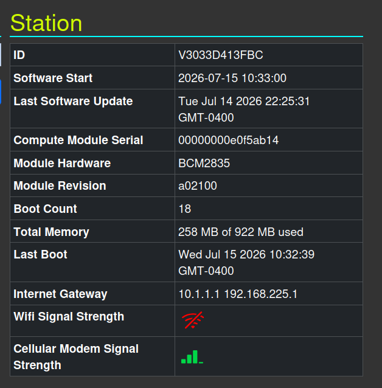
```

On the right-hand sidebar of the page you'll see the **Station** section, which includes various pieces of information about your SensorStation.

* `ID` - the serial number of your SensorStation (the cell modem's IMEI).
* `Software Start` - a date/time field referring to the last reboot time.
* `Compute Module Serial` - the serial number of your Raspberry Pi Compute Module.
* `Module Hardware` - the processor on the compute module.
* `Module Revision` - the compute module's hardware revision.
* `Boot Count` - the number of times the system has been booted up/turned on.
* `Total Memory` - the amount of RAM currently being used by the system.
* `Last Boot` - Datetime of last boot in local time.
* `Internet Gateway` - the IP address of the networking device or virtual component that bridges your local network (like a home or business) to the global internet.
* `Wifi Signal Strength` - the strength of the WiFi signal. 
  * Here the WiFi is disabled on the SensorStation.
  * Enabled WiFi signals will vary in the number of bars and color.
* `Cellular Modem Signal Strength` - the strength of the cell network connection. Here, the cell modem is enabled and has a moderately strong connection to the cell network.

## System Versioning Details

```{r system-versioning, echo=FALSE, fig.cap="System Version Details"}
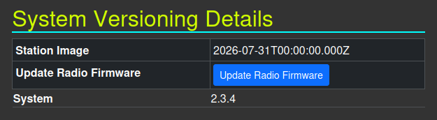
```

* `Station Image` - The disk image release date.
* `Update Radio Firmware` - Update the built-in and dongle 434 MHz radios (current version is 4.0.0).
* `System` - The disk image version number. The current version is 1.8.0.

```{r memory-cpu-usage, echo=FALSE, fig.cap="Memory and CPU Usage"}
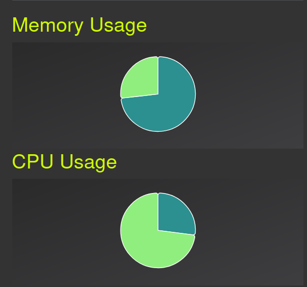
```

* `Memory Usage` - A pie chart indicating the amount of system RAM currently being used.
* `CPU Usage` - A pie chart indicating the amount of processing power currently being used.

Hover over the pie slices to see exact usage values:

```{r memory-used, echo=FALSE, fig.cap="Memory being used"}
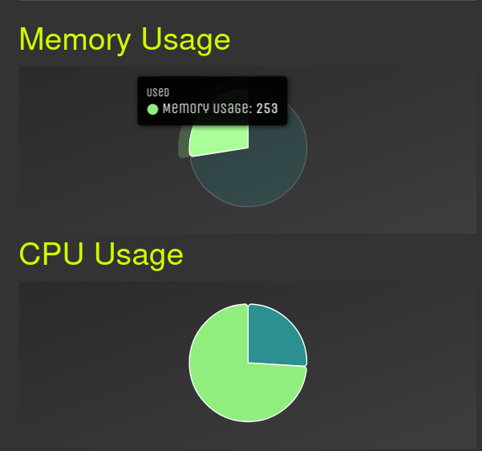
```

```{r memory-free, echo=FALSE, fig.cap="Free memory"}
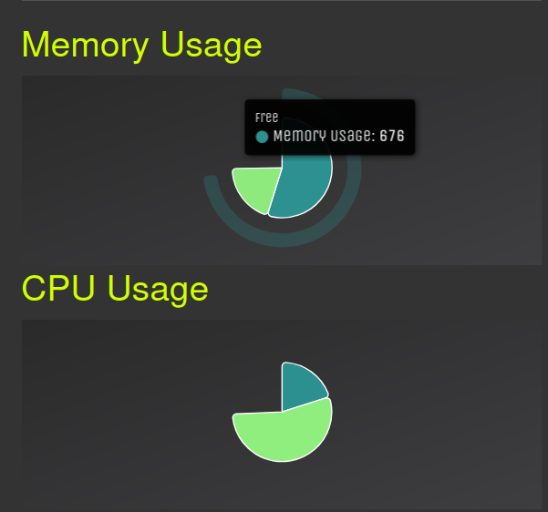
```

Same with the CPU pie chart, hover over the slices to see the exact usage values:

```{r cpu-used, echo=FALSE, fig.cap="CPU being used"}
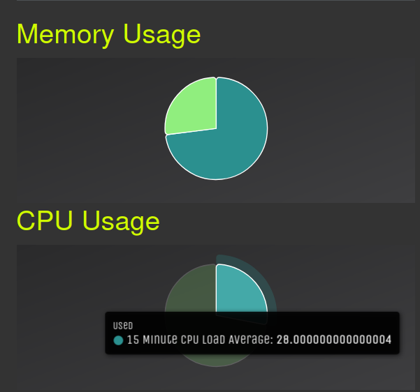
```

```{r cpu-free, echo=FALSE, fig.cap="Free CPU"}
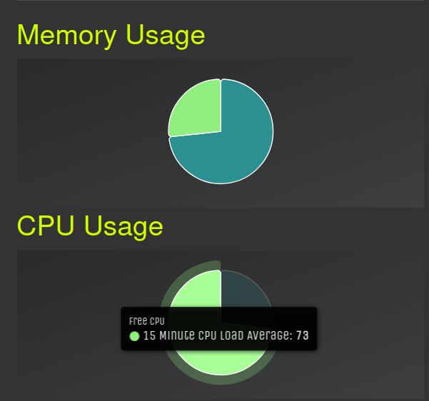
```

* `Time Sync Stats` - Detailed information of how the system time is being retrieved/synced (e.g. from GPS or the internet)

```{r time-sync, echo=FALSE, fig.cap="Time Sync Stats"}
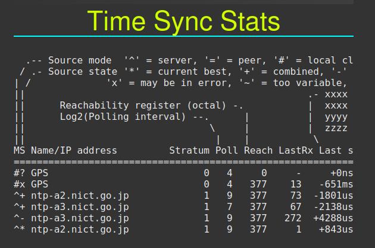
```

## SensorStation Log

```{r station-log, echo=FALSE, fig.cap="Station Log, messages about station activity"}
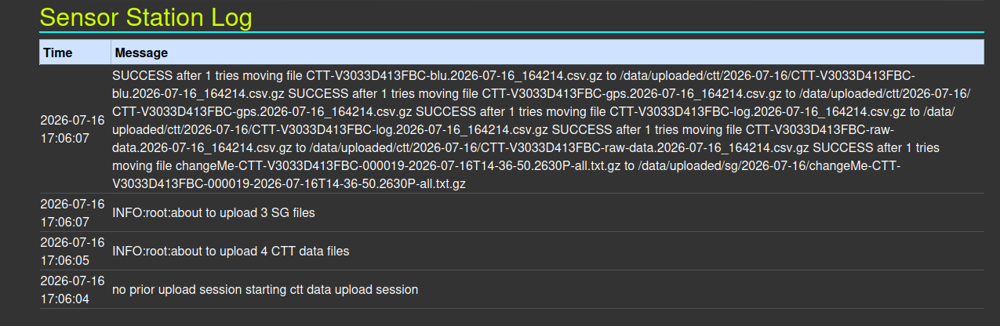
```

A log of SensorStation activity. Includes things such as screen updates and data retrieval flushes. In the picture above the log printed out the messages from a successful Data Upload process.

## GPS

```{r gps-info, echo=FALSE, fig.cap="GPS info"}
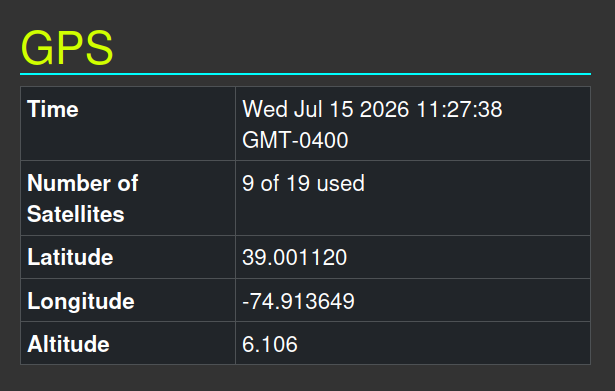
```

Information retrieved over GPS:

* `Time` - local time calculated by the GPS.
* `Number of Satellites` - number of satellites used to calculate GPS fix.
* `Latitude` - latitude in decimal notation.
* `Longitude` - longitude in decimal notation.
* `Altitude` -  calculated altitude of the station.

If there is currently no valid fix, these fields will be blank.

## Server Utilities

```{r server-utilities, echo=FALSE, fig.cap="Functions to connect to CTT servers"}
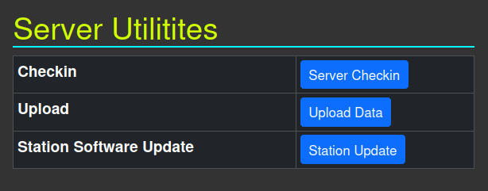
```

* `Checkin` - Sends the health check-in object to the CTT servers, letting us know that your station is still functioning properly.
* `Upload Data` - Uploads all data on the SensorStation to the CTT servers.
* `Station Software Update` - takes you to the Station Update webpage where you can obtain the latest updates on the Sensor Station Software.

**Requirement:**

  * Because these buttons require connecting to servers via the internet, your SensorStation must be connected to the internet, either via the *on-board LTE module*, hardwired via *Ethernet* (this includes being connected to a computer via Ethernet which is connected to the internet), or wirelessly via the built-in *WiFi module* (or *WiFi adapter* for v2 stations).

### Updating your SensorStation

  1. With the CTT Sensor Station Overview page open in your browser, scroll down to `Server Utilities` on the right sidebar.
  2. Click the button labeled `Station Update`, which will open the `Sensor Station Software Updater` console
```{r station-update, echo=FALSE, fig.cap="Station Update Page"}
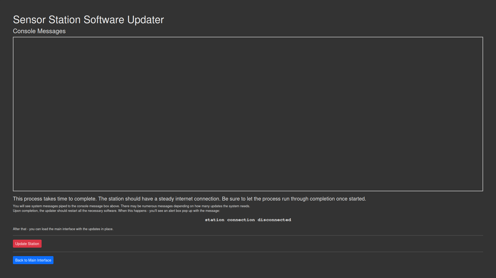
```
  3. Scroll down below the console window and click on the `Update Station` button. This will begin the update process. Be aware that the station will be pulling code from five different code bases, which may take up to several minutes depending on your connection speed.
  4. When the process is complete, you will receive a `Station connection disconnected` dialogue. **This indicates that the update is complete** and that the system has restarted. You may now click the dialogue to clear it, and then click the button at the bottom of the screen to go `Back to Main Interface`.

## Network Control

If you are running multiple FUNcubes, you should disable either the modem or WiFi for optimal performance. The buttons here allow you to do that.

```{r network-controls, echo=FALSE, fig.cap="Network Control buttons"}
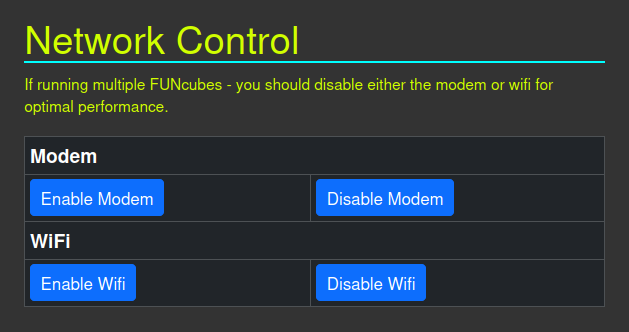
```

* `Enable Modem` - all SensorStations have the modem `disabled` when shipped to avoid unnecessary data usage costs. Clicking this button will enable the modem (depending on the modem type, you may need to reboot the station for the modem to become fully enabled).

* `Disable Modem` - disable the cell modem. If you are not connecting the station to the cell network, disable the modem to free up the USB bus (especially if you use the FCDs).

* `Enable WiFi` - WiFi is also disabled when SensorStations leave the CTT Office. You will need to add your WiFi credentials to the SensorStation through the USB method to connect to a WiFi network after enabling the WiFi.

* `Disable WiFi` - disable the WiFi module. If you are not connecting the station to a WiFi network, disable the WiFi to free up the USB bus (especially if you use the FCDs).

## Radio Software Control

```{r radio-software-control, echo=FALSE, fig.cap="Restart the Radio Software"}
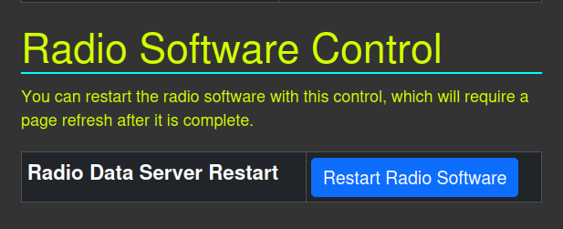
```

If you want to restart the 434 MHz radios, you can click the Restart Radio Software button.

## Display Control

```{r display-control, echo=FALSE, fig.cap="Tag detection display control"}
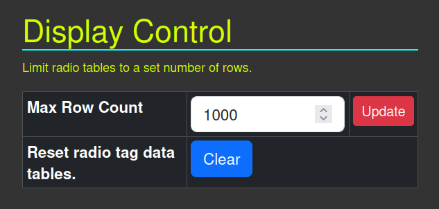
```

If you want to limit how many live tags you see in the radio tables below, change the Max Row Count value and click Update.

If you want to the clear all the tags on the radio tables below, click the Clear button. **Note:** this only clears the detected tags on the web interface; the detections are still saved to a .csv file on the SensorStation.

## Reboot Control

```{r reboot-control, echo=FALSE, fig.cap="Change the reboot schedule"}
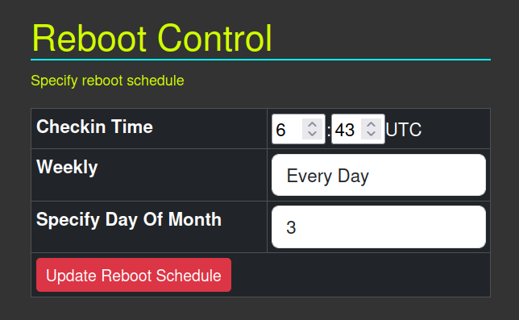
```

The SensorStation is currently set to reboot on the 3rd of each month at 6:43 UTC. Use this interface here to change the reboot cycle.

To change it to a Weekly reboot schedule, click the Weekly dropdown menu and select a day. The reboot will occur on that day each week.

**Note** Avoid choosing dates 29, 30, or 31 if you use the monthly reboot cycle since not all months have these dates.

## Radios (1-5)

```{r radio-434-tables, echo=FALSE, fig.cap="Live data from the built-in 434 MHz Radios"}
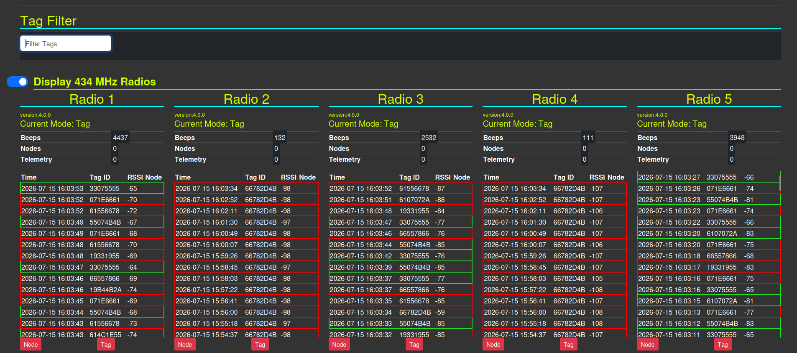
```

There is a display box for each Radio. The boxes will display all new data from each Radio as they are detected, informing you of the following:

* `Time` - tag detection time
* `Tag ID` - tag ID
* `RSSI` - tag received signal strength indicator (RSSI). Values closer to 0 means a stronger signal
* `Node` - the Node ID if the tag was detected by a Node

### Tag Filter

```{r tag-filter, echo=FALSE, fig.cap="Tag detections filtered for 614C1E55 based on a partial ID"}
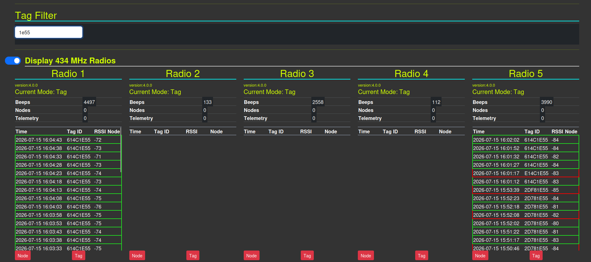
```

If you enter a tag ID or a partial tag ID you can filter the live tag detections for just that specific tag.

### Radio Configuration

Each of the five 434MHz radios can be individually configured to receive `Nodes` or `Tags (FSK)`, by clicking the corresponding button.

```{r radio-set-node, echo=FALSE, fig.cap="Configuring the radio to detect Nodes"}
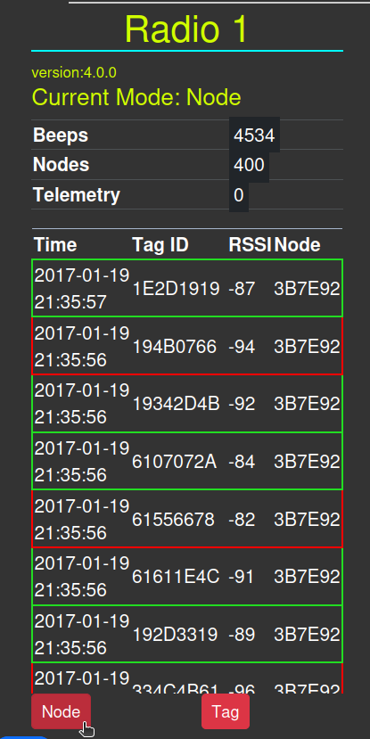
```

```{r radio-set-tag, echo=FALSE, fig.cap="Configuring the radio to detect Tags"}
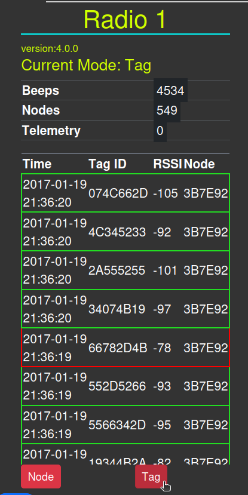
```

* `Node` = CTT Nodes Only
* `Tag` = CTT LifeTags, PowerTags, ES-200 and ES-150 GPS tags
* `OOK` = Legacy-style LifeTag only for limited specialized project, on <= 1.3.0 disk images only

::: {.version-v2}
On V1 SensorStations this configuration will only persist until the next webpage refresh unless you press the "Save Radio Configuration" button below, which will save the configuration permanently to memory. For V2 SensorStations the setting is automatically saved as soon as you acknowledge the confirmation popup after clicking the `Node`, `Tag` or `OOK` buttons for a particular radio.
:::

::: {.version-v33 .version-v32 .version-v30}
The setting is automatically saved as soon as you acknowledge the confirmation popup after clicking the `Node` or `Tag` buttons for a particular radio.
:::

Configurations can be changed at any time. **Note: Once you have changed the radio settings, the change is immediately saved and the data will flow from whichever you changed it to; node or tag, but in order to see the text description change on the web interface, you will need to refresh the webpage.**

`Clear Session Data` simply clears the scrolling log of tags displayed for each radio port. It does not delete any data from system memory.

## Dongle Radios

```{r dongle-radio, echo=FALSE, fig.cap="Dongle Radio detection table"}
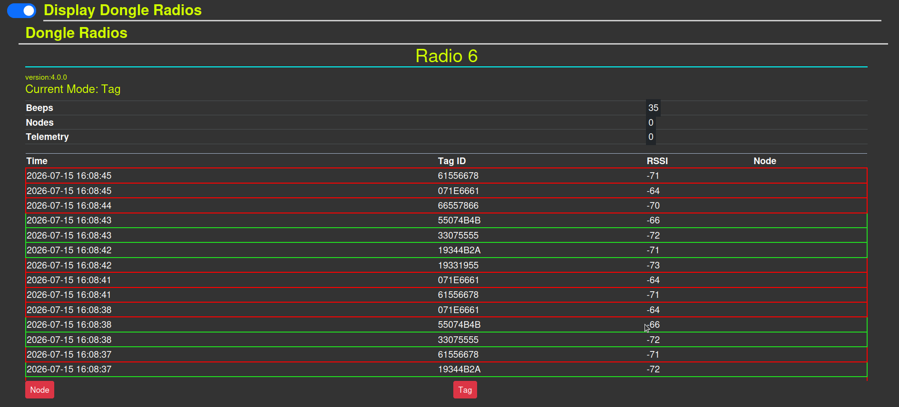
```

You can plug in extra 434 MHz radios (i.e. CTT Motus Adapters) into any of the SensorStation USB ports, and it will create a new Radio table on the web interface.

These radios can be programmed to detect Nodes or Tags.

## Tag Validation

In the above pictures, you will see some detections highlighted in green and some highlighted in red. This is due to the cyclic redundancy check (CRC), which is an error-checking code embedded in tag transmissions. The CRC is present on LifeTags (V2+) and HybridTags, but not PowerTags. If the CRC is valid, then the detection is highlighted in green. If not, it is highlighted in red. Since PowerTags do not have a CRC, they will **always** be highlighted in red.

## Blu Receiver

```{r blu-receiver, echo=FALSE, fig.cap="Blu Receiver on USB Port 5"}
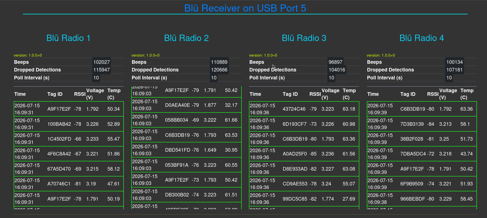
```

For stations running the >=1.4.0 disk image, you can plug in a CTT BluSeries Receiver into any USB port on the SensorStation and detect BluSeries tags.

Each Blu receiver has four 2.4 GHz radios. Each of those radios are displayed in their own individual radio tables.

### Blu Radio Table

```{r blu-radio, echo=FALSE, fig.cap="Blu Radio"}
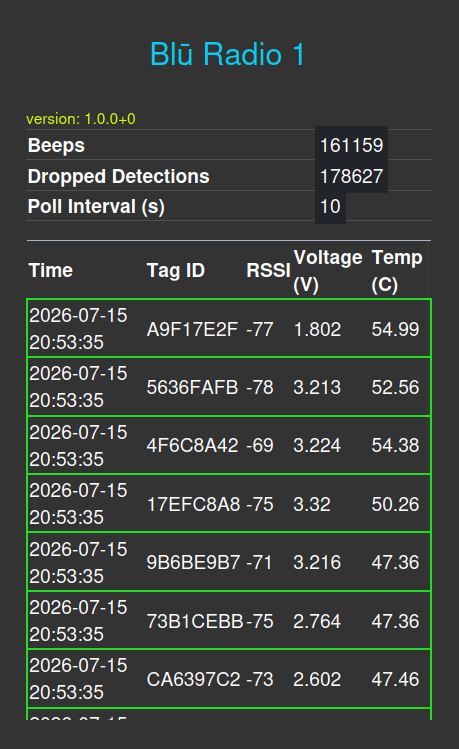
```

* `Time` - time of tag detection
* `Tag ID` - 4 byte long ID of the tag
* `RSSI` - Received Signal Strength Indicator (RSSI) of the tag. Values closer to 0 are stronger signals.
* `Voltage (V)` - solar/battery voltage in Volts
* `Temp (C)` - ambient temperature in degrees Celsius

### Blu Radio Summary Data

```{r blu-radio-summary, echo=FALSE, fig.cap="Blu Radio Summary Data"}
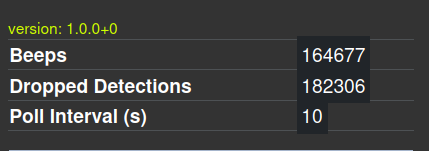
```

* `version` - blu radio firmware version
* `Beeps` - number of detections on this specific radio
* `Dropped Detections` - due to how the blu radios detect data (i.e. a ring buffer), if there is a large volume of tag detections, some of those detections will be dropped. This will most likely not be the case in field settings.
* `Poll Interval` - time duration between the radio polling for tags.

## Data Management

```{r data-management, echo=FALSE, fig.cap="Data Management buttons"}
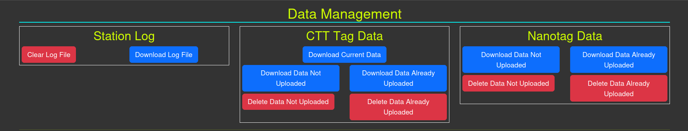
```

Here you can download and/or delete the Station logs, CTT data (434 MHz and BluSeries data), and Nanotag Data (FUNcube/RTL-SDR data).

### Station Log

Allows you to **download** (`Download Log File`) and **PERMANENTLY DELETE** (`Clear Log File`) the system log file. Used for informational and debugging purposes.

### CTT Tag Data

The tag data is divided into `Current Data`, `Data Not Uploaded`, and `Data Already Uploaded`. Current Data is data from the last 30 minutes. After 30 minutes, data is rotated into Data Not Uploaded, which is data beyond the last 30 minutes which has not yet been uploaded to CTT servers. If there is an internet connection via cell or ethernet, an upload attempt occurs every 2 hours. After data is uploaded, it is rotated into `Data Already Uploaded` and will stay there until you explicitly delete it. The red Delete buttons will **PERMANENTLY DELETE** the corresponding data from the SensorStation. An *are you sure* dialogue will make sure you do not accidentally delete data.

### Nanotag Data

Nanotag Data uses the same scheme as CTT Tag Data, except that currently data from the last 30 minutes is unavailable from this screen. The Sensorgnome interface is separately accessible as described below.

## Nanotag Data / SensorGnome Interface

```{r nanotag-data, echo=FALSE, fig.cap="Nanotag data section"}
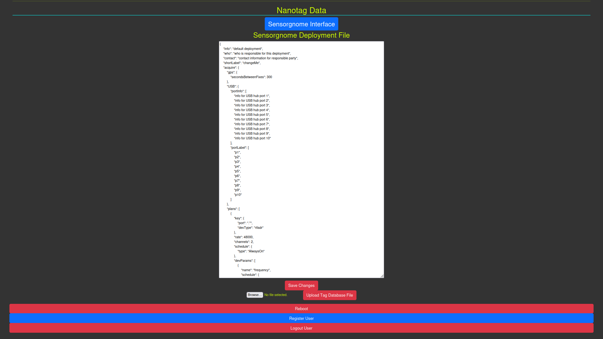
```

### SensorGnome Interface

Click the "SensorGnome Interface" button to go to the SensorGnome interface.

The CTT SensorStation uses the v1 SensorGnome web interface. Motus has detailed instructions [here](https://docs.motus.org/sensorgnome/v1/webinterface).

### SensorGnome Deployment File

```{r sensorgnome-deployment, echo=FALSE, fig.cap="SensorGnome Deployment File"}
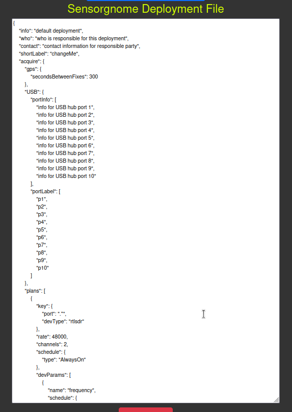
```

The SensorGnome Deployment file is used to modify the FUNcube/RTL-SDR radio frequencies. You can scroll within the deployment file window to find your specific Motus radio. Once you find your radio, replace the default frequency value with your desired value (you can click and type in the deployment file window).

For example, here is the frequency value for the funcubePro:

```{r sensorgnome-default-freq, echo=FALSE, fig.cap="funcubePro default value"}
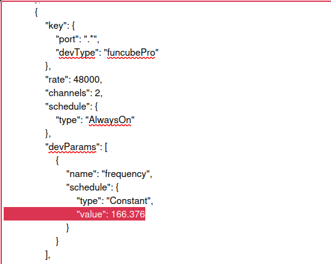
```

Here, we changed the frequency value to 150.096, the radio frequencies used in Europe and the UK.

```{r sensorgnome-modified-freq, echo=FALSE, fig.cap="funcubePro modified value"}
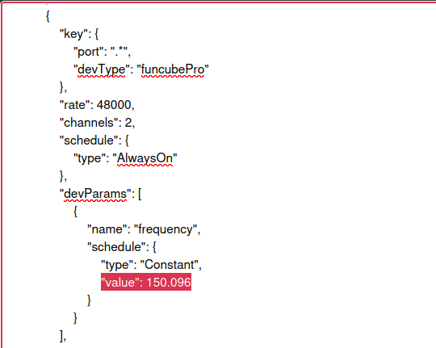
```

Any changes to the SensorGnome Deployment file will not be saved until you click the `Save Changes`.

More information about the deployment file can be found [here](https://docs.motus.org/sensorgnome/v1/appendix/configuring-the-sensorgnome-frequency#on-a-sensorgnome).

## Reboot Button

```{r reboot-button, echo=FALSE, fig.cap="Reboot button"}
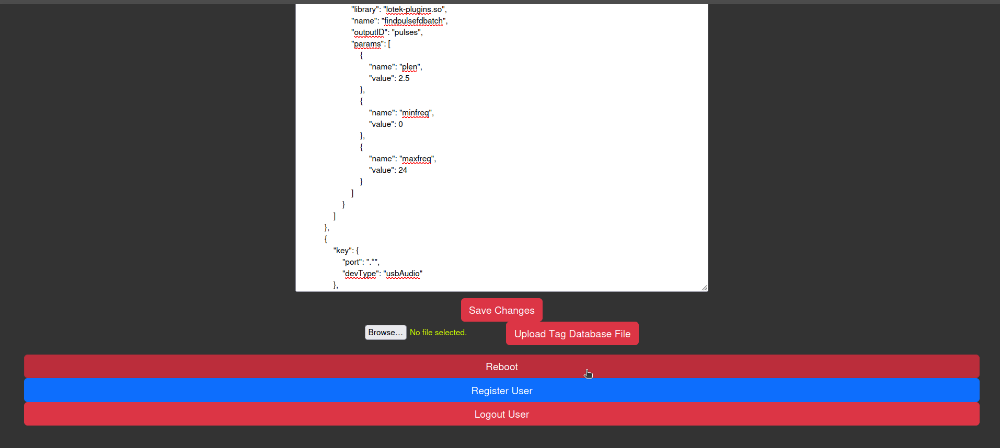
```

This button performs a soft reboot (power is still connected to the SensorStation). You will need to refresh the web page after your station has booted up again.

## Register User

```{r register-user-button, echo=FALSE, fig.cap="Register User button"}
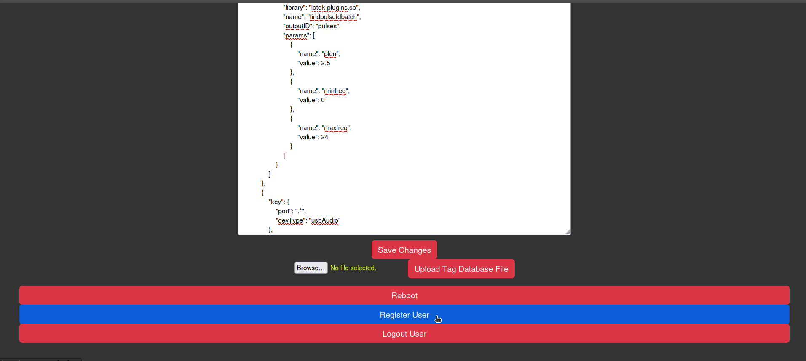
```

If your SensorStation is connected to a public internet network and you want to protect the Web Interface from unauthorized visitors, click the `Register User` button.

**Note** This does not protect against someone accessing your station through ssh. If they have the station IP address and station username/password, they are able to access your station.

```{r register-email, echo=FALSE, fig.cap="Register email web page"}
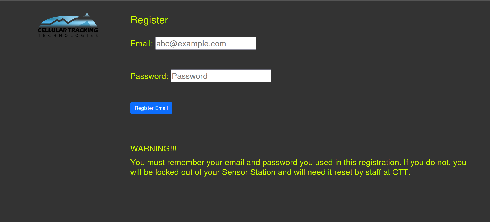
```

It will take you to the above web page. Enter your email address and a password that is at least 8 characters long.

**WARNING** It is `YOUR` responsibility to store your email address and password. CTT does not store this information. If you forget your email address and/or password, you will need to contact CTT to reset the users for this station.

Once you register a user, if you type in the SensorStation IP address or `sensorstation.local` in the URL bar, you will see this page instead:

```{r login-page, echo=FALSE, fig.cap="Login page"}
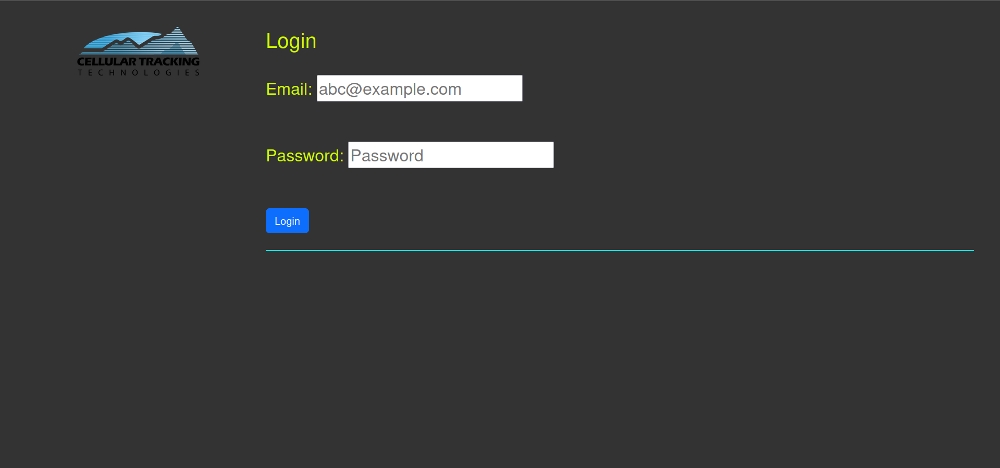
```

Enter in your credentials to get back to the main Web Interface web page.

## Logout User

```{r logout-user, echo=FALSE, fig.cap="Logout User"}

```

The last button on the Web Interface is the Logout User button. Click this button to log out your current signed-in user. Users will be logged out automatically after 10 min of inactivity.
