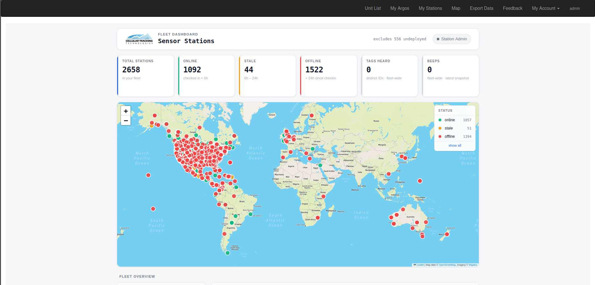

# The SensorStation Account Portal {#data-portal}

The SensorStation Account Portal at [account.celltracktech.com](https://account.celltracktech.com) is the web-based interface for monitoring your SensorStation fleet, viewing station health, and downloading data files. This chapter walks through the main sections of the portal.

## Logging In {-}

Navigate to [https://account.celltracktech.com](https://account.celltracktech.com) and log in with the username and password provided to you in your shipping email or by CTT support. If you have forgotten your password, click the **Forgot your password?** link on the login page.

## Navigation Bar {-}

Once logged in, the top navigation bar provides access to the main sections of the portal:

* **Unit List** - View your GPS/GSM transmitter units
* **My Argos** - Access Argos satellite data (if applicable)
* **My Stations** - View your SensorStations
* **Map** - View all your devices on a map
* **Export Data** - Download data exports
* **Feedback** - Submit feedback to CTT
* **My Account** - Manage your account settings

## Fleet Dashboard {-}

The Fleet Dashboard is the main landing page at `account.celltracktech.com/station/checkins/`. It provides an at-a-glance overview of all SensorStations in your fleet.

### Summary Cards {-}

At the top of the page, six summary cards display fleet-wide statistics:

| Card | Description |
| :--- | :---------- |
| **Total Stations** | The total number of SensorStations in your fleet |
| **Online** | Stations that have checked in within the last 6 hours |
| **Stale** | Stations that last checked in between 6 and 24 hours ago |
| **Offline** | Stations that have not checked in for more than 24 hours |
| **Tags Heard** | The number of distinct tag IDs detected fleet-wide |
| **Beeps** | The total number of tag beeps detected in the latest snapshot |

### Fleet Map {-}

Below the summary cards is an interactive map showing the location of all your stations. Stations are color-coded by their status:

* **Green** - Online (checked in within 6 hours)
* **Orange** - Stale (checked in 6-24 hours ago)
* **Red** - Offline (no check-in for more than 24 hours)

You can zoom in and out using the `+` and `-` buttons or your scroll wheel. The legend in the upper-right corner shows the count for each status and a **show all** link to reset the filter.

### Fleet Overview {-}

Below the map, the Fleet Overview section contains two panels:

**Projects** - A list of your projects with the number of stations associated with each. Click a project name to filter the station list below.

**Checkin Freshness** - A horizontal bar chart showing how recently your stations have checked in, broken into time buckets:

* `< 1h` - Checked in within the last hour
* `1-6h` - Checked in 1 to 6 hours ago
* `6-24h` - Checked in 6 to 24 hours ago
* `1-3d` - Checked in 1 to 3 days ago
* `> 3d` - Have not checked in for more than 3 days

This chart is useful for quickly identifying how many stations may need attention.

### Sensor Stations Table {-}

The Sensor Stations table lists all stations in your fleet. You can search for a specific station using the **Search** box (e.g., by station ID, alias, or project name). The table columns are:

| Column | Description |
| :----- | :---------- |
| **Status** | Online, stale, or offline, with how long ago the last check-in occurred |
| **ID** | The unique SensorStation hardware ID |
| **Alias** | A user-assigned name for the station (if set) |
| **Project** | The project the station is associated with |
| **Beeps** | Total number of tag beeps recorded by this station |
| **Tags** | Number of distinct tag IDs detected |
| **Where** | GPS coordinates (latitude, longitude) of the station — click to view on a map |
| **Last Seen** | The date and time (UTC) of the station's last check-in |

Click **Open** on any row to navigate to that station's detail page.

### Recent Checkins Table {-}

Below the Sensor Stations table is the **Recent Checkins** table, which shows a chronological log of check-ins across all stations. The columns are:

| Column | Description |
| :----- | :---------- |
| **Checkin At** | Date and time (UTC) of the check-in |
| **ID** | The SensorStation hardware ID |
| **Project** | The project name |
| **Boot** | The boot count (number of times the station has rebooted) |
| **Beeps** | Cumulative beep count at the time of check-in |
| **Tags** | Number of distinct tags detected at the time of check-in |
| **Lat** | Latitude from GPS |
| **Lng** | Longitude from GPS |
| **Uptime** | Time since last reboot (e.g., `2d 6h` for 2 days, 6 hours) |

Click **Open** on any row to view that station's detail page.

## Individual Station Page {-}

Clicking **Open** on a station from the fleet dashboard takes you to the station's detail page at `account.celltracktech.com/station/station-home/<StationID>/`. This page provides a comprehensive view of that station's health, activity, and data.

### Station Header {-}

At the top of the page you will see:

* The **Station ID** (e.g., `6CA25D375881`)
* The station **Alias** (e.g., `Meadows V2`)
* A status badge indicating when the station last checked in (e.g., "checked in 51d ago") with a color indicator:
  * **Green** - Online
  * **Red** - Offline

### Quick Stats Cards {-}

Six cards provide a snapshot of the station's current state:

| Card | Description |
| :--- | :---------- |
| **Battery** | The current battery/power voltage (e.g., `11.61 V`) with a sparkline showing recent trend |
| **Solar** | The solar panel voltage (e.g., `0.00 V` if no solar monitor is connected) |
| **Free Disk** | Available disk space in MB (e.g., `18.0k MB`) with a sparkline trend |
| **Modem Signal** | Cellular modem signal strength in dBm (`—` if not connected) |
| **Active Nodes** | Number of nodes heard in the last 24 hours |
| **Reboots** | Number of reboots, with a stability indicator (`stable` if 0) and sparkline |

### Station Map {-}

An interactive map showing the station's GPS location. Click the marker for details.

### Station Details Panel {-}

To the right of the map, the Station Details panel displays detailed information organized into sections:

**Status**

* `Last checkin` - Date/time of the last check-in (UTC) and how long ago
* `Last reboot` - Date/time of the last reboot (UTC) and uptime since
* `Free disk` - Available disk space

**Hardware**

* `Model` - The Raspberry Pi compute module model (e.g., `BCM2835`) and board revision
* `Serial` - The compute module serial number

**Software**

* `Image` - The disk image creation date
* `Last update` - The date of the last software update
* `Version` - The current software version (e.g., `1.4.0`)

**Connectivity**

* `Carrier` - The cellular carrier name (e.g., `Twilio`)
* `SIM` - The SIM card number

### Power & System Charts {-}

Four time-series charts track the station's power and system health over time:

* **Battery Voltage** - Battery voltage trend over time (in Volts). A healthy station on AC power will show a steady line around 11-12V. Solar-powered stations will show daily charge/discharge cycles.
* **Solar Voltage** - Solar panel voltage over time. Values above 0V indicate active solar charging.
* **Free Disk Space** - Available disk space over time (in MB). A sawtooth pattern is normal — disk fills as data is collected, then drops after files are uploaded and rotated. A steadily decreasing trend may indicate an upload problem.
* **Modem Signal** - Cellular signal strength over time (in dBm). Values closer to 0 are stronger. A flat line at the bottom indicates no cellular connection.

### Detection Activity {-}

This section summarizes the station's tag detection performance.

**Recent Detections** (left panel):

* `Total Beeps` - Total number of tag beeps detected across all radios
* `Unique Tags` - Number of distinct tag IDs detected
* `Avg / Tag` - Average number of beeps per tag
* `Radios Hearing` - How many of the 5 radio channels are actively detecting tags (e.g., `3 / 5`)
* Per-radio breakdown showing beep count and tag count for each radio (R1 through R5)

**Top Tags** (right panel):

A horizontal bar chart showing the most-heard tags since the last statistics snapshot. Each bar shows the tag ID, total beep count, and how many channels heard it (e.g., `3/5 ch`).

### Upload Queue {-}

Two charts track the station's data upload backlog:

* **Pending Files** - Number of data files queued but not yet uploaded over time. A low, steady count is normal. A growing backlog may indicate connectivity issues.
* **Pending Bytes** - Total size of the upload backlog over time.

### Stability {-}

**Uptime & Reboots** - A chart showing the station's uptime (in days) over time. The green area represents continuous uptime, and red dots mark reboot events. Drops to zero indicate reboots. Frequent reboots may indicate power issues or USB bus overload (see the [Maintenance chapter](#maintenance)).

### Network {-}

**Nodes** - Shows the 7-day battery trend for each node connected to the station. If no nodes have checked in recently, a message will indicate this.

### Checkins Table {-}

A paginated table of all historical check-ins for this station, with the following columns:

| Column | Description |
| :----- | :---------- |
| **Checkin At** | Date and time (UTC) of the check-in |
| **Boot Count** | Number of reboots at the time of this check-in |
| **Uptime** | Time since last reboot |
| **Beep Count** | Cumulative beep count |
| **Tag Count** | Number of distinct tags detected |

### Per-Node Battery History {-}

Click **Show charts** to display battery voltage trends for individual nodes over time. This is useful for identifying nodes with failing batteries.

### Data Files {-}

At the bottom of the station page is the **Data Files** section, where you can browse and download raw data files. Files are organized into tabs:

| Tab | Description |
| :-- | :---------- |
| **Radio** | 434 MHz radio tag detection files (raw-data CSV files, gzipped) |
| **Node Health** | Node health reports including battery voltage, temperature, and signal strength |
| **Log** | Station log files recording system events |
| **GPS** | GPS coordinate logs |
| **Telemetry** | Station telemetry data |
| **BluSeries** | 2.4 GHz BluSeries tag detection files |
| **Sensorgnome** | 166 MHz SensorGnome/Lotek detection files (shared with Motus) |

Each file row shows:

* `Rotated At` - The date/time the file was finalized and rotated
* `Size` - The file size
* `Filename` - The full filename (format: `CTT-<StationID>-raw-data.<date>_<time>.csv.gz`)

Click **Download** to download an individual file.

**Note:** Raw files are downloadable from this portal. SensorGnome data is also shared with Motus automatically.
